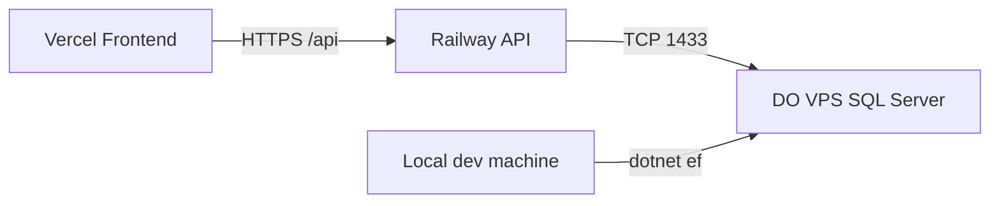

# Tummly QA Backend Deployment Guide

## What we built

A **hybrid QA stack** for the Tummly ASP.NET Core API:

| Component | Platform | URL / host |
|-----------|----------|------------|
| **Frontend** | Vercel | `https://tummly.vercel.app` |
| **Backend API** | Railway | `https://tummly-backend-production.up.railway.app` |
| **Database** | DigitalOcean VPS (Docker SQL Server) | Public IP on port 1433 |

We initially tried hosting SQL Server on Railway, but the **1 GB free tier** was too small and caused crash loops. Moving SQL Server to a **DigitalOcean droplet** fixed that.

---

## Architecture



---

## What we changed in the codebase

### Backend (`backend/TummlyBackend/`)

1. **`Program.cs`**
   - Binds to Railway's `PORT` env var
   - CORS from config (`Cors:AllowedOrigins`)
   - `/health` — liveness (Railway healthcheck)
   - `/health/ready` — checks DB connection
   - Migrations/seeding run **in the background** after startup (so `/health` responds even if DB is slow)

2. **`appsettings.json` / `appsettings.Development.json`**
   - Secrets removed from base config; production values come from Railway env vars
   - Local dev keeps localhost SQL Express settings

3. **`AuthService.cs`**
   - Password reset links use `Frontend:BaseUrl` instead of hardcoded localhost

4. **New deployment files**
   - `Dockerfile` — .NET 10 container
   - `railway.toml` — Docker build + `/health` healthcheck
   - `.env.example` — Railway variable template

### Database VPS (`backend/TummlyDb/vps/`)

- `docker-compose.yml` — SQL Server 2022 Express in Docker
- `.env.example` — SA password template
- `setup.sh` — installs Docker, opens firewall, starts SQL Server

---

## Step-by-step: reproduce this setup

### Part 1 — SQL Server on DigitalOcean

1. **Create a droplet** (Ubuntu, ≥2 GB RAM recommended for SQL Server).

2. **Copy VPS files** to the server:

   ```bash
   scp -r backend/TummlyDb/vps root@YOUR_VPS_IP:~/
   ```

3. **Configure password** (must meet SQL Server rules: 8+ chars, upper, lower, number, symbol):

   ```bash
   cd ~/vps
   cp .env.example .env
   nano .env   # set MSSQL_SA_PASSWORD
   ```

4. **Run setup** (or manually):

   ```bash
   chmod +x setup.sh
   ./setup.sh
   ```

   This installs Docker, opens **UFW** port 1433, and starts SQL Server.

5. **DigitalOcean cloud firewall** — allow inbound **TCP 1433** (QA: `0.0.0.0/0`).

6. **Verify SQL is up**:

   ```bash
   docker compose ps
   docker compose logs --tail=20 mssql
   # Look for: "SQL Server is now ready for client connections"
   ```

7. **Important:** The SA password is set on **first boot only**. To change it later:

   ```bash
   docker compose down -v   # wipes data
   nano .env
   docker compose up -d
   ```

---

### Part 2 — Apply database schema (from your PC)

1. Install EF tools (once):

   ```powershell
   dotnet nuget add source https://api.nuget.org/v3/index.json -n nuget.org
   dotnet tool install --global dotnet-ef
   ```

2. Run migrations against the VPS:

   ```powershell
   cd backend\TummlyBackend
   $env:ConnectionStrings__DefaultConnection = 'Server=YOUR_VPS_IP,1433;Database=TummlyDB;User Id=sa;Password=YOUR_SA_PASSWORD;TrustServerCertificate=True;Encrypt=False;'
   dotnet ef database update
   ```

   **Pass when:** output ends with `Done.`

---

### Part 3 — Deploy API to Railway

1. Push code to **GitHub**.

2. **Railway** → New Project → Deploy from GitHub.

3. Create service **TummlyBackend**:
   - Root directory: `backend/TummlyBackend`
   - Builds from `Dockerfile` via `railway.toml`

4. **Set variables** (see `backend/TummlyBackend/.env.example`). Critical ones:

   ```
   ASPNETCORE_ENVIRONMENT=Production
   ConnectionStrings__DefaultConnection=Server=YOUR_VPS_IP,1433;Database=TummlyDB;User Id=sa;Password=YOUR_SA_PASSWORD;TrustServerCertificate=True;Encrypt=False;
   Database__ApplyMigrationsOnStartup=true
   Frontend__BaseUrl=https://tummly.vercel.app
   Cors__AllowedOrigins__0=https://tummly.vercel.app
   JwtSettings__Secret=<long-random-secret>
   ```

   Railway uses **double underscores** (`__`) for nested .NET config keys.

5. **Deploy** and verify:

   ```powershell
   curl https://YOUR-APP.up.railway.app/health        # 200
   curl https://YOUR-APP.up.railway.app/health/ready   # 200 when DB connected
   ```

---

## Problems we hit and fixes

| Problem | Cause | Fix |
|---------|--------|-----|
| Build failed (NuGet) | No NuGet source configured | `dotnet nuget add source https://api.nuget.org/v3/index.json` |
| Railway healthcheck failed | Migrations blocked startup | Moved migrations to background; `/health` returns immediately |
| SQL Server crash loop on Railway | 1 GB RAM too small | Moved DB to DigitalOcean VPS |
| `Login failed for user 'sa'` | Password mismatch vs first SQL boot | `docker compose down -v`, reset `.env`, recreate container |
| `/health` OK, `/ready` 503 | Wrong Railway connection string | Fix `ConnectionStrings__DefaultConnection` to match VPS `.env` exactly |
| `dotnet-ef` not found | Tool not installed | `dotnet tool install --global dotnet-ef` |

---

## Connection string rules

- Use the VPS **public IP** (Railway is outside DigitalOcean's private network).
- Include `TrustServerCertificate=True;Encrypt=False;` for self-hosted SQL.
- Password must match **VPS `.env`** and **Railway variable** exactly.
- Variable name must be `ConnectionStrings__DefaultConnection` (not `ConnectionString`).

---

## Verify everything works

```powershell
# From your PC — port open?
Test-NetConnection YOUR_VPS_IP -Port 1433

# Railway API
curl https://tummly-backend-production.up.railway.app/health
curl https://tummly-backend-production.up.railway.app/health/ready

# Default seeded admin (if seed ran)
# Email: admin@tummly.com  Password: Admin@123
```

---

## Optional next steps

- Point frontend env to `https://tummly-backend-production.up.railway.app/api`
- Configure **Resend** SMTP in Railway email variables
- Restrict DO firewall to Railway egress IPs for better security (not required for QA)
- Change default admin password after first login

---

## Repo reference paths

| Path | Purpose |
|------|---------|
| `backend/TummlyBackend/` | API + Railway deploy |
| `backend/TummlyBackend/.env.example` | Railway env template |
| `backend/TummlyDb/vps/` | SQL Server on DigitalOcean |
| `backend/TummlyDb/vps/setup.sh` | One-shot VPS setup script |
