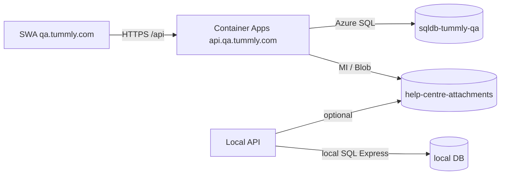

# Tummly QA Deployment Guide

## Current QA stack (Azure)

| Component | Platform | URL / host |
|-----------|----------|------------|
| **Frontend** | Azure Static Web Apps | `https://qa.tummly.com` |
| **Backend API** | Azure Container Apps | `https://api.qa.tummly.com` |
| **Database** | Azure SQL | `sql-tummly-qa-centralus.database.windows.net` / `sqldb-tummly-qa` |
| **Object storage** | Azure Blob | `sttummlyqavfavue` / container `help-centre-attachments` |

Resource group: `rg-tummly-qa`. Deploy from the **`qa`** branch via GitHub Actions (`.github/workflows/qa-frontend.yml`, `qa-backend.yml`). Infra: `infra/qa/`.

The previous Vercel / Railway / DigitalOcean SQL + Spaces stack has been **retired**. Do not redeploy QA there.

---

## Architecture


```mermaid
flowchart LR
    FE[SWA qa.tummly.com] -->|HTTPS /api| API[Container Apps api.qa.tummly.com]
    API -->|Azure SQL| DB[(sqldb-tummly-qa)]
    API -->|MI / Blob| BLOB[(help-centre-attachments)]
    DEV[Local API] -->|optional| BLOB
    DEV -->|local SQL Express| LOCALDB[(local DB)]
```

---

## Day-to-day deploy

1. Merge or push to the **`qa`** branch.
2. GitHub Actions builds and deploys:
   - Frontend → Static Web Apps (`VITE_API_BASE_URL` → `https://api.qa.tummly.com/api`)
   - Backend → ACR → Container Apps (OIDC + managed identity for ACR pull / Blob)
3. Probe:

   ```powershell
   curl https://api.qa.tummly.com/health
   curl https://api.qa.tummly.com/health/ready
   ```

---

## Secrets and app settings

| Where | What |
|-------|------|
| Container App env | Copy from Railway-shaped keys in `infra/qa/secrets.qa.env` (gitignored); apply with `infra/qa/apply-aca-secrets.ps1` |
| GitHub repo secrets | OIDC (`AZURE_*`), SWA deployment token, etc. — see `infra/qa/setup-github-oidc.ps1` |
| DNS / Resend | [`infra/qa/DNS-HANDOFF.md`](../infra/qa/DNS-HANDOFF.md), [`infra/qa/RESEND-HANDOFF.md`](../infra/qa/RESEND-HANDOFF.md) |

Env key template for the API: [`backend/TummlyBackend/.env.example`](./TummlyBackend/.env.example).

---

## Local development

- **SQL:** local SQL Express (or Docker) via `appsettings.Development.json` / user secrets — not Azure SQL by default.
- **Attachments:** point local at **Azure QA Blob** (same account/container as QA):

  ```text
  ObjectStorage__Provider=AzureBlob
  ObjectStorage__Endpoint=https://sttummlyqavfavue.blob.core.windows.net
  ObjectStorage__Bucket=help-centre-attachments
  ObjectStorage__ConnectionString=<storage account connection string>
  ```

  Fetch the connection string (do not commit it):

  ```powershell
  az storage account show-connection-string `
    --name sttummlyqavfavue `
    --resource-group rg-tummly-qa `
    --query connectionString -o tsv
  ```

  Local and Azure QA share one container; use distinct test data or clean up keys if uploads collide.

- **Frontend local:** `VITE_API_BASE_URL` → your local API or `https://api.qa.tummly.com/api` as needed. CORS already allows `http://localhost:5173`.

---

## Reproduce / expand Azure QA

1. `infra/qa/deploy.ps1` — Bicep core (SWA, ACA, ACR, SQL, Blob, identity).
2. Wire secrets → `apply-aca-secrets.ps1`.
3. Push to `qa` for image + SWA deploy.
4. Custom domains: Freeola records in `DNS-HANDOFF.md`, then bind in Azure (already done for current hosts).

---

## Verify

```powershell
curl https://qa.tummly.com
curl https://api.qa.tummly.com/health
curl https://api.qa.tummly.com/health/ready

# Seeded admin (if seed ran on fresh Azure SQL)
# Email: admin@tummly.com  Password: Admin@123
# Email: support@tummly.com  Password: Support@123
```

Change default admin passwords after first login.

---

## Repo reference paths

| Path | Purpose |
|------|---------|
| `infra/qa/` | Bicep, deploy scripts, DNS/Resend handoffs, secret apply |
| `.github/workflows/qa-*.yml` | Deploy from `qa` branch |
| `backend/TummlyBackend/` | API + Dockerfile |
| `backend/TummlyBackend/.env.example` | Env key template (Azure QA + local) |
| `backend/TummlyDb/vps/` | Legacy DO SQL scripts — **not used for QA** |

---

## Retired stack (do not use for QA)

Previously: Vercel (`tummly.vercel.app`), Railway API, DigitalOcean SQL VPS, DO Spaces. Removed after Azure QA smoke sign-off. `railway.toml` and `backend/TummlyDb/vps/` may remain in the repo as historical artifacts only.
