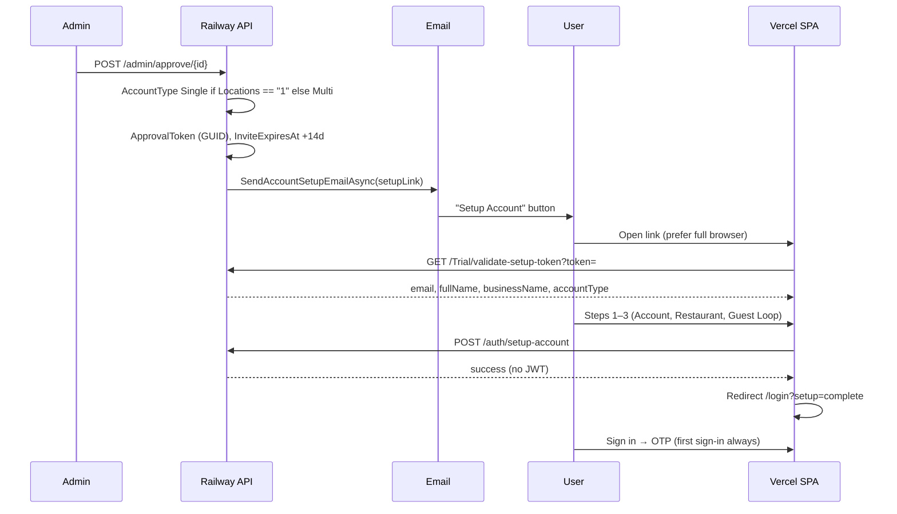

# Guest Loop & account setup audit

**Status:** In progress — fixes implemented locally; pending deploy to Vercel + Railway  
**Last updated:** 2026-06-15  
**Related:** [sign_in_flows.md](./sign_in_flows.md) (sign-in vs account setup), [form_function.md](./form_function.md)

Audit of the post-approval **Account Setup** flow (single + multi), including Guest Loop step 3, QA blank-screen investigation, and approval email behaviour.

**Legend:** ✅ Fixed (local) · 🟡 Partial · ❌ Open · 🔧 Deploy required

---

## Scope

| In scope | Out of scope |
|----------|--------------|
| Admin approve → email → `/setup-account-single` / `-multi` | Sign-in workspace setup (A5) — see sign_in_flows |
| Token validation + 3-step wizard | Trial request / OTP on homepage |
| Guest Loop fields persisted to `GuestLoopSetup` | Multi-dashboard / operator UI after login |
| QA blank screen on email click | Admin dashboard UI |

---

## End-to-end flow (intended)



**Canonical routes**

| Account type | Email link path | Page component |
|--------------|-----------------|----------------|
| Single (`Locations == "1"`) | `/setup-account-single?token=` | `RegisterSinglePage` |
| Multi | `/setup-account-multi?token=` | `RegisterMultiPage` |
| Legacy redirect | `/setup-account?token=` | `SetupAccountPage` → redirects to single/multi |

---

## QA blank screen — root cause (confirmed)

### Symptom

On QA (`https://tummly.vercel.app`), clicking **Setup Account** in the approval email showed a **blank white page**, with:

- No `validate-setup-token` network call
- No React/console errors (initially)
- HTML + JS bundle loading in Network tab only

Pasting the same URL into Chrome/Safari **worked**.

### Actual cause: email client sandbox (not API, not token)

Console message when clicking from email:

```text
Blocked script execution in 'https://tummly.vercel.app/setup-account-single?token=…'
because the document's frame is sandboxed and the 'allow-scripts' permission is not set.
```

Many email clients open links in a **sandboxed in-app iframe** that loads HTML/CSS but **blocks JavaScript**. Tummly is a React SPA — without JS, `#root` stays empty → blank screen.

| Check | Result |
|-------|--------|
| Token valid on API | ✅ `GET validate-setup-token` returns 200 |
| CORS Vercel → Railway | ✅ Preflight allows `https://tummly.vercel.app` |
| Console/error suppression in app | ❌ None — no Sentry, no `drop_console`, no ErrorBoundary |
| App sets sandbox headers | ❌ None in `vercel.json` or codebase |

**Implication:** This is a **UX/email-client concern**, not a backend bug. Mitigations are email + fallback copy, not React logic alone.

### Initial misdiagnosis (superseded)

We initially suspected an old `useEffect(..., [form, token])` render loop on production. That may still affect users who open in a **real browser** on the **old Vercel build**, but it does **not** explain the sandbox symptom (no JS runs at all).

---

## Issues found

| # | Issue | Severity | Status |
|---|--------|----------|--------|
| 1 | Email button opens in sandboxed iframe → JS blocked → blank page | **High** | 🟡 `target="_blank"` + fallback link added to email; not a full fix for all clients |
| 2 | Production Vercel still on old setup page build | **High** | 🔧 Deploy frontend changes |
| 3 | Guest Loop step 3: `touchpoints` / `feedbackTags` collected in UI but not saved | **High** | ✅ Payload + `AuthController` mapping fixed |
| 4 | `GuestLoopSetup.Touchpoints` was set from `rolloutApproach` (`"Single"`) | **High** | ✅ Fixed |
| 5 | Post-setup navigated to protected `/single-dashboard` without JWT | Medium | ✅ Redirect to `/login?setup=complete` + banner |
| 6 | Setup routes nested under `MainLayout` (navbar on invite flow) | Medium | ✅ Moved outside layout (with login/forgot-password) |
| 7 | Fragile token validation (`response.data.data`, `[form, token]` deps) | Medium | ✅ `useSetupTokenValidation` + `setupToken.ts` |
| 8 | No account-type guard (multi token on single URL) | Medium | ✅ Auto-redirect to correct setup path |
| 9 | Phone validation: trial form flexible, setup required 11 digits | Medium | ✅ Aligned with `mobileSchema` |
| 10 | `Frontend:BaseUrl` not validated on approve → broken relative links | Medium | ✅ `AdminService.GetFrontendBaseUrl()` |
| 11 | `POST /auth/setup-account` missing `IsApproved` check, no token trim | Medium | ✅ Fixed |
| 12 | User `Role` from trial form slug vs JWT `Owner` | Low | ✅ Setup sets `Role = "Owner"` |
| 13 | Three competing setup endpoints (see below) | Low | ❌ Open — cleanup |
| 14 | Re-approve always rotates token (invalidates old email) | Low | ❌ Open |
| 15 | Email subject vs body heading mismatch | Low | ❌ Open |
| 16 | `TrialController` / `ValidateSetupToken` `Console.WriteLine` in prod | Low | ❌ Open |
| 17 | No static fallback in `index.html` when JS blocked | Medium | ❌ Open |
| 18 | No React `ErrorBoundary` on setup routes | Low | ❌ Open |

---

## Duplicate setup endpoints (technical debt)

| Endpoint | Implementation | Used by frontend? |
|----------|----------------|-------------------|
| `POST /auth/setup-account` | Full logic in `AuthController` | ✅ `RegisterSinglePage` / `RegisterMultiPage` |
| `POST /auth/complete-setup` | `AuthService.CompleteAccountSetupAsync` → **stub returns `true`** | ❌ |
| `POST /Trial/complete-setup` | `TrialService` — different data model | ❌ |

**Recommendation:** Remove or implement stubs; single source of truth should be `/auth/setup-account`.

---

## Changes implemented (local, pending deploy)

### Frontend

| File / area | Change |
|-------------|--------|
| `src/hooks/useSetupTokenValidation.ts` | Shared token validation; safe deps; account-type redirect |
| `src/lib/setupToken.ts` | Parse camelCase/PascalCase API responses; setup path helpers |
| `src/components/auth/SetupAccountShell.tsx` | Loading/error shell (always visible UI) |
| `src/pages/auth/RegisterSinglePage.tsx` | Uses hook; post-setup → `/login?setup=complete` |
| `src/pages/auth/RegisterMultiPage.tsx` | Same pattern as single |
| `src/pages/routes/AppRoutes.tsx` | Setup routes outside `MainLayout` |
| `src/pages/auth/LoginPage.tsx` | Green banner when `?setup=complete` |
| `src/pages/auth/SetupAccountPage.tsx` | Redirects to `/setup-account-single` or `-multi` |
| `src/schemas/accountSetupSingle.ts` | Phone schema; `touchpoints` / `feedbackTags` in payload |
| `src/types/trial.ts` | `touchpoints`, `feedbackTags` on `CompleteSetupPayload` |
| `src/api/trialApi.ts` | `validateSetupToken` uses plain `axios` (avoids 401 interceptor on public call) |
| `src/lib/setupToken.test.ts` | Parser + path tests |

### Backend

| File / area | Change |
|-------------|--------|
| `AdminService.cs` | Validate absolute `Frontend:BaseUrl`; `BuildSetupLink()` helper |
| `EmailService.cs` | `target="_blank"` + `rel="noopener noreferrer"` on setup button; copy-paste fallback URL in body |
| `AuthController.cs` | Token trim; `IsApproved` check; nullable expiry; Guest Loop field mapping; `Role = "Owner"`; phone from DTO |
| `CompleteSetupDto.cs` | `Touchpoints`, `FeedbackTags` properties |

---

## Guest Loop — step 3 data mapping (single setup)

| UI field (RegisterSinglePage) | API payload field | DB column (`GuestLoopSetup`) | Before audit | After fix |
|-------------------------------|-------------------|------------------------------|--------------|-----------|
| Touchpoints (checkboxes) | `touchpoints` (comma-separated) | `Touchpoints` | ❌ Not sent | ✅ |
| Feedback tags (checkboxes) | `feedbackTags` (comma-separated) | `FeedbackTags` | ❌ Not sent | ✅ |
| Thank you message | `thankYouMessage` | `ThankYouMessage` | ✅ | ✅ |
| Offer headline / details / expiry / redemption / usage | `offerTitle`, etc. | `OfferHeadline`, etc. | ✅ | ✅ |
| — | `rolloutApproach: "Single"` | was wrongly stored in `Touchpoints` | ❌ | ✅ Separated |

**Multi setup:** Guest Loop UI differs; confirm parity in a follow-up pass on `RegisterMultiPage` payload vs `GuestLoopSetup`.

---

## Still open / missed

1. **`index.html` static fallback** — Message visible when JS is blocked (email sandbox): *“Open this link in Chrome or Safari.”*
2. **React `ErrorBoundary`** on setup routes — Surface render errors instead of white screen in real browser.
3. **Remove dead endpoints** — `/auth/complete-setup` stub, unused `/Trial/complete-setup` or align implementations.
4. **Admin re-approve guard** — Block or warn when re-approving already-approved requests (token rotation).
5. **Email polish** — Align subject (“Setup Invitation”) with body (“Approved”); consider same `target="_blank"` on password reset link.
6. **Remove debug logging** — `TrialController.ValidateSetupToken` console writes.
7. **Multi Guest Loop audit** — Verify multi wizard sends all step-3/config fields correctly.
8. **Production verification** — After deploy, confirm QA bundle no longer contains `"Validating setup token..."` (old loading copy).

---

## Future enhancements

| Item | Notes |
|------|-------|
| Plain-text email part | Include setup URL for clients that strip HTML |
| “Open in browser” deep link | Some products use intermediate page with manual open button; heavy-handed |
| Server-side setup progress | Optional token-scoped draft if users abandon mid-wizard |
| E2E test | Playwright: paste invite URL → complete single setup → land on login with banner |
| Link tracking / redirect service | Only if marketing needs it; adds complexity |

---

## QA checklist (post-deploy)

### Email

- [ ] Approve single-location trial → email received
- [ ] Setup link is absolute: `https://tummly.vercel.app/setup-account-single?token=…`
- [ ] Click **Setup Account** — opens new tab; setup wizard loads (not blank)
- [ ] If blank in in-app mail, copy fallback URL → works in Chrome
- [ ] Resend invite uses same link pattern

### Single setup wizard

- [ ] Token validates; email/name/business pre-filled
- [ ] Step 1: password + terms
- [ ] Step 2: restaurant/location/phone (accepts `+44` style numbers)
- [ ] Step 3: touchpoints + feedback tags + thank-you message
- [ ] Submit → `/login?setup=complete` with success banner
- [ ] Sign in with new password → OTP → dashboard

### API / data

- [ ] `GuestLoopSetup.Touchpoints` and `FeedbackTags` populated (not `"Single"`)
- [ ] `Users.Role` = `Owner` after setup
- [ ] Second use of same token rejected

### Environment

- [ ] Railway: `Frontend__BaseUrl=https://tummly.vercel.app`
- [ ] Railway: `Cors__AllowedOrigins__0=https://tummly.vercel.app`
- [ ] Vercel: latest frontend deploy includes setup route + hook changes

---

## Deploy notes

1. **Frontend (Vercel)** — All `src/` changes + new hook/lib/shell files.
2. **Backend (Railway)** — `AdminService`, `EmailService`, `AuthController`, `CompleteSetupDto`.
3. **Re-test with a new approval or resend invite** — Old emails unchanged; email HTML updates only on newly sent messages.
4. **Debugging tip** — Blank page + no API calls + sandbox console message = email client issue. Blank page + API calls failing = token/CORS/backend issue.

---

## File index (this audit)

| Path | Purpose |
|------|---------|
| `docs/guest-loop-audit.md` | This document |
| `src/hooks/useSetupTokenValidation.ts` | Token gate for setup pages |
| `src/lib/setupToken.ts` | Response parsing + route helpers |
| `src/components/auth/SetupAccountShell.tsx` | Loading/error layout |
| `backend/.../EmailService.cs` | Approval email template |
| `backend/.../AdminService.cs` | Approve + link generation |
| `backend/.../AuthController.cs` | `POST setup-account` |
