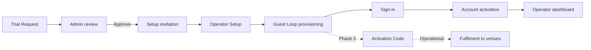

# Tummly product documentation

**Product version:** 2026.07.01  
**Last reviewed:** 2026-07-01 (codebase audit)  
**Audience:** Managers, AI agents, onboarding engineers

Tummly is a restaurant guest-relationship platform. Operators capture feedback, manage offers, and run campaigns across single or multi-location hospitality businesses.

This documentation set describes **what the product does**, **what is shipped vs planned**, and **how flows connect** across frontend, backend, and operations. Definitions are inlined — do not depend on external glossary files.

## How to read these docs

| Badge | Meaning |
|-------|---------|
| **Shipped** | Live in the current release; behaviour verified against codebase |
| **Partial** | Some paths work; gaps or stubs documented |
| **Planned** | Specified target; not implemented or not fully wired |
| **Operational (manual)** | Process outside the app (support, fulfilment, legal) |

Each feature block includes: user flow, states, backend actions, edge cases, screens, emails, compliance notes, and launch blockers where relevant.

**Engineers:** Product docs are canonical for behaviour truth. Screen-level Figma parity and audit history live in legacy implementation notes (see [Legacy documentation](#legacy-documentation)).

## Document index

| Document | Scope | Batch |
|----------|-------|-------|
| [trial-request.md](./trial-request.md) | Marketing Trial Request, OTP, emails, review handoff | 1 |
| [admin.md](./admin.md) | Admin dashboard, trial review, activation admin | 1 |
| [operator-setup.md](./operator-setup.md) | Single/multi Operator Setup, provisioning, guest links | 1 |
| [sign-in.md](./sign-in.md) | Sign-in, OTP, password reset, trusted device | 1 |
| [activation-and-fulfilment.md](./activation-and-fulfilment.md) | Activation code, trial period, starter kit, fulfilment | 1 |
| [marketing-site.md](./marketing-site.md) | Public pages, CTAs, claims register | 2 |
| [guest-feedback.md](./guest-feedback.md) | Guest capture form, thank-you, offers | 2 |
| [analytics.md](./analytics.md) | Shipped page views + Target event map | 2 |
| [security-and-rbac.md](./security-and-rbac.md) | Roles, isolation, sessions, audit gaps | 2 |
| [support-playbooks.md](./support-playbooks.md) | Support topic index (SOPs TBD) | 2 |

## Status summary

| Domain | Shipped | Partial | Planned | Hard launch blockers |
|--------|---------|---------|---------|----------------------|
| Trial Request | Form, OTP, received email | — | — | None |
| Admin review | Approve, decline, more info, resend, extend activation | — | Audit log | None for soft launch |
| Operator Setup | Wizard, provisioning, five default QR codes per location | Bulk upload UX | Per-location starter QR packs / Shop fulfillment | None |
| Sign-in | Password, OTP, trusted device, reset | SMS OTP; workspace APIs | — | None |
| Activation | Code generation, activation gate, 30-day period | — | Welcome email, in-app fulfilment tracking | Fulfilment is operational |
| Guest feedback | 3-field form, thank-you | Operator inbox basic | Opt-in, offers, tags | None |
| Marketing site | All sections live | Claims vs product | Claims alignment pass | **Starter QR, guest list, offers/campaigns copy** — see [marketing-site.md](./marketing-site.md) |
| Analytics | Page views + consent | — | Custom events, funnels | None |
| Security | JWT, roles, isolation, activation gate, account lock (5 attempts) | Admin lock on universal-login | Audit log | Audit only if contract requires |
| Support | Admin actions list | — | Playbooks, ticketing | None |

See [CHANGELOG.md](./CHANGELOG.md) for version history.

## End-to-end lifecycle



## Local quick start

```bash
# Frontend (repo root)
npm run dev

# Backend
cd backend/TummlyBackend && dotnet run
```

Deployment and environment variables: [backend/DEPLOYMENT.md](../../backend/DEPLOYMENT.md).

## Maintenance

Update product docs in the **same PR** when you change:

- A user flow (steps, states, emails)
- A route or API endpoint listed in these docs
- A feature's Shipped / Partial / Planned status

Record the change in [CHANGELOG.md](./CHANGELOG.md) and bump **Product version** when Shipped or Partial behaviour changes.

## Legacy documentation

These files are **implementation supplements**. Product truth lives in `docs/product/`.

| Legacy file | Superseded by | Still useful for |
|-------------|---------------|------------------|
| [sign_in_flows.md](../sign_in_flows.md) | [sign-in.md](./sign-in.md) | Figma screen IDs, OTP decision log |
| [guest-loop-audit.md](../guest-loop-audit.md) | [operator-setup.md](./operator-setup.md) | Deploy checklist, QA notes |
| [form_function.md](../form_function.md) | Domain product files | Form component stack |
| [pending-work.md](../pending-work.md) | CHANGELOG + product status tables | Historical build plan |
