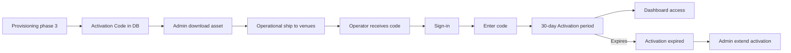

# Activation and fulfilment

Account **Activation Code**, **Activation period**, physical **Activation fulfilment**, and **Starter QR materials** — what is automated in software vs handled operationally.

## Status summary

| Feature | Status |
|---------|--------|
| Activation Code generation | Shipped |
| Activation Code entry at Sign-in | Shipped |
| Activation gate (API block) | Shipped |
| 30-day Activation period | Shipped |
| Admin view/copy/download activation asset | Shipped |
| Admin extend activation | Shipped |
| Physical Activation fulfilment | Operational (manual) |
| Starter QR materials (per location) | Planned |
| Self-print PDF for operators | Planned |
| Fulfilment status in app | Planned |
| Delivery tracking | Planned |
| QR reorders | Planned |
| Welcome email after setup | Planned |

## Domain terms

| Term | Definition |
|------|------------|
| **Activation Code** | 8-character code from unambiguous charset; displayed as `XXXX-XXXX`; stored hashed; one per account |
| **Account activation** | Operator enters valid code → `ActivatedAt` set; **Activation period** begins |
| **Pending activation** | After Operator Setup, before activation — Sign-in allowed; dashboard APIs blocked. True when `ActivatedAt == null` even if phase 3 code generation failed |
| **Activation period** | 30 calendar days UTC after activation — full dashboard access |
| **Activation expired** | Period ended — Sign-in blocked; admin may **Extend activation** |
| **Activation fulfilment** | Physical print/ship of Activation Code to each **Owned location** address |
| **Starter QR materials** | Future per-location print pack (table tents, stickers) — distinct from account Activation Code |
| **Trial start trigger** | **Activation period** starts at successful **Account activation** — not at Trial Request or Operator Setup |

---

## Activation Code generation

| | |
|---|---|
| **Status** | Shipped |
| **Launch blocker** | None |

### User flow

During Operator Setup **Guest Loop provisioning** phase 3, frontend calls `POST /api/auth/generate-activation-code` with invite token.

### Backend actions

- `GuestLoopProvisioningService.GenerateActivationCodeAsync`
- Generates 8-char code; stores `ActivationCodeHash` + `ActivationCodeEncrypted` on `User`
- Idempotent if code already exists for user

### Edge cases

| Case | Behaviour |
|------|-----------|
| Invalid invite token | Error |
| Code already generated | No-op / success |

### Entry points

`RegisterSinglePage.tsx` / `RegisterMultiPage.tsx` → `authActivation.ts` → `AuthController`

---

## Activation Code screen

| | |
|---|---|
| **Status** | Shipped |
| **Launch blocker** | None |
| **Compliance** | No skip; no self-service resend in v1 |

### User flow

1. Operator completes Sign-in (and OTP if required).
2. `GET /api/auth/me` returns `activationRequired: true`.
3. **Activation Code screen** shown (`SignInActivationCodeStep`).
4. Operator enters code → `POST /api/auth/activate`.
5. On success → **Activation period** starts → operator dashboard.

### Screens

| Screen | Route | Fields | Data updated | Analytics |
|--------|-------|--------|--------------|-----------|
| Activation Code | `/login` (step) | activationCode | `Users.ActivatedAt`, `ActivationExpiresAt`; hash **retained** for admin display | `page_view`; `account_activated` (Planned) |

### Edge cases

| Case | Behaviour |
|------|-----------|
| Wrong code | Inline error; **5 failed attempts** → 15-minute lockout (in-memory per user) |
| Already activated | Activate endpoint rejects |
| Activation expired at Sign-in | Blocked before activation screen |
| No self-service resend | Operator contacts support; admin uses drawer |

### Entry points

`SignInActivationCodeStep.tsx` → `authActivation.ts` → `AuthService.ActivateAccountAsync`

---

## Activation gate

| | |
|---|---|
| **Status** | Shipped |
| **Launch blocker** | None |

### Behaviour

`ActivationGateMiddleware` blocks operator APIs when:

- **Pending activation** — 403 `activationRequired`
- **Activation expired** — 403 `activationExpired`

**Allowed paths:** `/api/auth/me`, `/api/auth/activate`. Workspace endpoints (`/api/auth/workspaces`, `/api/auth/select-workspace`) are not implemented and are **not** allowlisted — add them to `ActivationGateMiddleware` when they ship, or pending operators will get 403 during workspace selection.

Admins exempt.

---

## Activation period

| | |
|---|---|
| **Status** | Shipped |
| **Launch blocker** | None |

### Rules

- Starts at `ActivatedAt` (UTC)
- Ends `ActivatedAt.AddDays(30)` (`ActivationPeriodDays = 30`) — calendar days, not a fixed 720-hour window
- Customer copy may say "30-day free trial"; domain term is **Activation period**
- Does not start until **Account activation** — **Pending activation** has no time limit

### Activation expired

- Sign-in rejected with trial-ended message
- Active session ends on next gated API call

---

## Admin activation tools

| | |
|---|---|
| **Status** | Shipped |
| **Launch blocker** | None |

See [admin.md](./admin.md#activation-administration):

- View/copy activation code in **Operator details**
- Download print-ready **SVG** asset
- **Extend activation** for expired accounts (new end date; no new code)

---

## Activation fulfilment (physical)

| | |
|---|---|
| **Status** | Operational (manual) |
| **Launch blocker** | Soft — process must exist before scale; not enforced in software |

### Target process (operational)

1. Operator completes Operator Setup → Activation Code generated in DB.
2. Admin downloads activation asset from **Operator details**.
3. Operations prints same code for each **Owned location** address from Operator Setup.
4. Packs ship to venue addresses.
5. Operator receives code physically; enters at Sign-in.

### Software today

- No fulfilment status field on `TrialRequest` or `User`
- No delivery tracking integration
- No operator-facing "where is my pack?" UI

### Edge cases

| Case | Handling (manual) |
|------|-------------------|
| Code lost before mail arrives | Support → admin copy from drawer |
| Wrong address | Support → re-ship operationally |
| Never received | Support verifies fulfilment queue |

---

## Starter QR materials

| | |
|---|---|
| **Status** | Planned |
| **Launch blocker** | **Hard** if marketing claims physical starter packs without operational capacity — see [marketing-site.md](./marketing-site.md) (Batch 2) |

### Target (not Shipped)

- Per-location print pack with location-specific **QR code**
- Generated during provisioning phase 3 (future)
- Shipped to each venue **Address**
- Operator self-print PDF option
- Reorder flow for damaged/lost materials

### Shipped today

- **QR code** PNG downloadable from operator dashboard (`GET /api/qr/download`) — digital only
- Provisioning UI phase 3 label references "starter QR materials" but backend runs Activation Code generation only

---

## Trial start trigger (clarification)

| Event | Starts Activation period? |
|-------|----------------------------|
| Trial Request submitted | No |
| Trial approved | No |
| Operator Setup complete | No — enters **Pending activation** |
| Activation Code entered successfully | **Yes** |

---

## Flow diagram

## Not yet live

| Item | Status | Launch blocker |
|------|--------|----------------|
| Setup complete / welcome email | Planned | Soft |
| Starter QR per-location packs | Planned | Hard if marketed as shipped |
| Self-print PDF | Planned | Soft |
| Fulfilment status in admin | Planned | Soft for ops scale |
| Delivery tracking | Planned | Soft |
| QR reorders in app | Planned | Soft — dashboard re-download works for digital QR |
| Token rotation for compromised links | Planned | Soft |

## Implementation notes

- Code constants: `ActivationCodeHelper.cs` (charset, 30-day period)
- Legacy: [guest-loop-audit.md](../guest-loop-audit.md)
