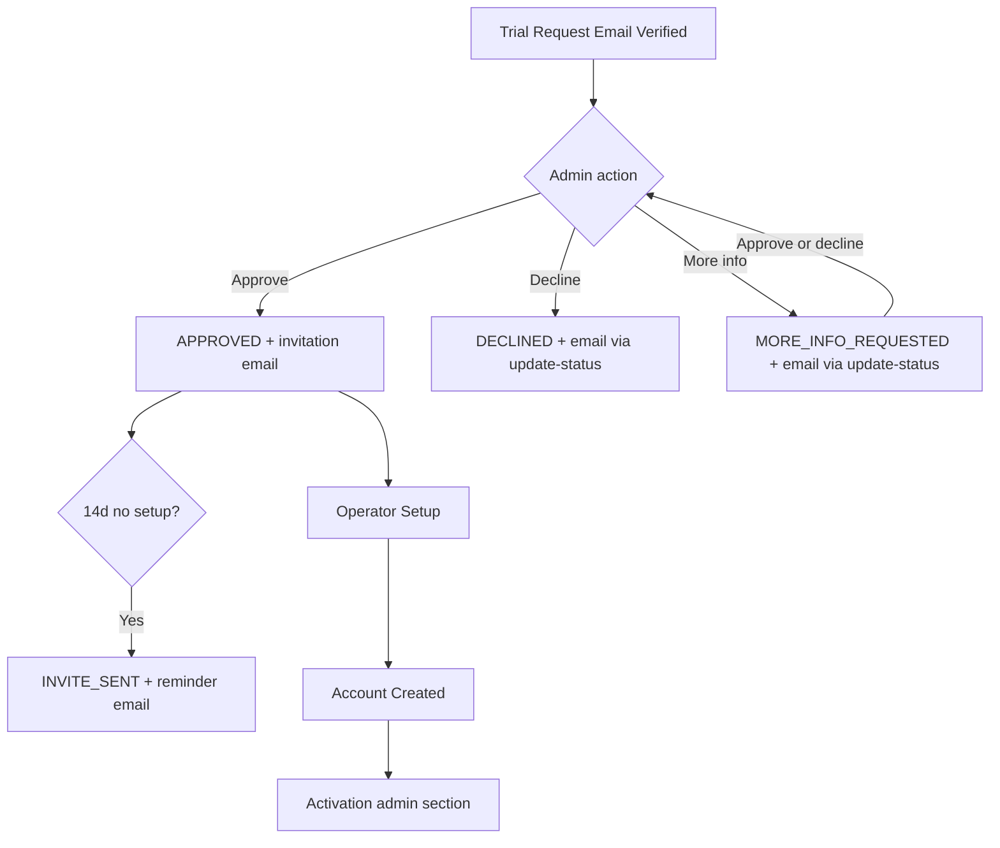

# Admin features

Platform admin workflows for **trial request review**, operator account oversight, and activation support. Admins authenticate separately from operators and use the **admin dashboard** at `/admin-dashboard`.

## Status summary

| Feature | Status |
|---------|--------|
| Trial requests table | Shipped |
| Operator details drawer | Shipped |
| Approve / decline / request more info | Shipped |
| Resend Operator Setup invitation | Shipped |
| Automatic invitation reminders | Shipped |
| Extend activation | Shipped |
| Activation code view / copy / download | Shipped |
| QA trial purge | Shipped (env-gated) |
| Admin action audit log | Planned |

## Domain terms

| Term | Definition |
|------|------------|
| **Trial request review** | Admin workflow to approve, request more information, or decline a verified Trial Request |
| **Operator details** | Admin drawer for one Trial Request — application data, review actions, activation section |
| **Operator Setup invitation** | Email with link to begin Operator Setup after approval |
| **Operator Setup invitation reminder** | Automatic re-send when setup not completed within 14 days of last invitation |
| **Decline** | Closes request with `DECLINED`; requires operator-facing reason |
| **Request more info** | Pauses review with `MORE_INFO_REQUESTED`; requires operator-facing message |
| **Extend activation** | Restores dashboard access after **Activation expired** without reissuing code |
| **Activation status badge** | Simplified label: Activated vs Not activated (in table and drawer header) |

---

## Admin Sign-in

| | |
|---|---|
| **Status** | Shipped |
| **Launch blocker** | None |
| **Compliance** | Separate `Admins` table from operators |

### User flow

1. Admin opens `/login`.
2. Enters credentials → `POST /api/auth/universal-login` or `admin-login`.
3. On admin match → JWT with role `Admin` → redirect `/admin-dashboard`.

### Backend actions

| Endpoint | Purpose |
|----------|---------|
| `POST /api/auth/admin-login` | Admin JWT |
| `POST /api/auth/universal-login` | Detects admin vs operator |

Admins are **not** subject to the **Activation gate**.

### Entry points

`LoginPage.tsx` → `AuthController` → `AuthService` → `Admins` table

---

## Trial requests table

| | |
|---|---|
| **Status** | Shipped |
| **Launch blocker** | None |

### User flow

1. Admin lands on `/admin-dashboard`.
2. `GET /api/admin/trial-requests` loads all requests.
3. Table shows business name, owner, account type, status badges, activation badge (when account exists).
4. Search filters client-side; pagination (10 per page).
5. Row actions menu or **Operator details** drawer for detail and actions.

### Screens

| Screen | Route | Permissions | Data read | Analytics |
|--------|-------|-------------|-----------|-----------|
| Admin dashboard | `/admin-dashboard` | JWT role Admin | `TrialRequests`, linked `Users` / locations | `page_view` |

### Entry points

`Dashboard.tsx` (admin) → `adminApi.ts` → `AdminController` → `AdminService`

---

## Approve Trial Request

| | |
|---|---|
| **Status** | Shipped |
| **Launch blocker** | None |

### User flow

1. Admin confirms approve (table menu or drawer).
2. `POST /api/admin/approve/{trialRequestId}`.
3. Backend sets approved state, generates `ApprovalToken`, `InviteExpiresAt` (+14 days).
4. Sends **Operator Setup invitation** email.
5. UI optimistically updates row; drawer stays open.

### States

| Status after action | Meaning |
|---------------------|---------|
| `APPROVED` | Approval email dispatched — **status stays `APPROVED`** (not `INVITE_SENT`) |
| `INVITE_SENT` | Set only on **manual resend** or **automatic reminder** — not on initial approve |

### Backend actions

- Rotate invite token (GUID)
- `InviteSentAt = now`, `InviteExpiresAt = now + 14d`
- `SendAccountSetupEmailAsync` — subject: *Create your account and start your Tummly trial*
- Setup link: `{Frontend:BaseUrl}/setup-account-single?token=` or `setup-account-multi?token=`

### Edge cases

| Case | Behaviour |
|------|-----------|
| Request not found | Error response |
| Already declined | **UI blocks** re-approve (`canReviewTrialRequest`); API does not enforce |
| `Frontend:BaseUrl` missing | Server error on send |

### Emails

| Email | Trigger | Subject | Status |
|-------|---------|---------|--------|
| Operator Setup invitation | Approve or manual resend | Create your account and start your Tummly trial | Shipped |

---

## Decline Trial Request

| | |
|---|---|
| **Status** | Shipped |
| **Launch blocker** | None |
| **Compliance** | Decline reason stored and emailed to applicant |

### User flow

1. Admin chooses Decline → feedback dialog (required message, max 2000 chars).
2. `PUT /api/admin/update-status` with `{ trialRequestId, status: "DECLINED", declineReason }`.
3. Status → `DECLINED`; `DeclineReason` stored; decline email sent.

**Note:** `POST /api/admin/decline/{id}` exists but is **not used by the dashboard** — it does not accept a reason body and does not persist `DeclineReason`.

### Emails

| Email | Subject | Status |
|-------|---------|--------|
| Trial decline | Update on your Tummly trial request | Shipped |

### Edge cases

- Declined requests cannot be approved again in **UI** (`canReviewTrialRequest`); API does not enforce
- Empty feedback rejected with validation error

---

## Request more info

| | |
|---|---|
| **Status** | Shipped |
| **Launch blocker** | None |

### User flow

1. Admin chooses Request more info → feedback dialog (required).
2. `PUT /api/admin/update-status` with `{ trialRequestId, status: "MORE_INFO_REQUESTED", moreInfoMessage }`.
3. Status → `MORE_INFO_REQUESTED`; `MoreInfoMessage` stored; email sent.

While `isApproved` is false, admin can still **Approve** or **Decline** after more info (UI allows review until approved or declined).

**Note:** `POST /api/admin/request-more-info/{id}` exists but is **not used by the dashboard** — it sends email without persisting the admin message.

### Emails

| Email | Subject | Status |
|-------|---------|--------|
| Trial more info | Action required: Tummly trial request | Shipped |

---

## Update trial status (decline / more info)

| | |
|---|---|
| **Status** | Shipped |
| **Launch blocker** | None |

### User flow

Primary path for decline and request-more-info from the dashboard.

| Endpoint | Body | Purpose |
|----------|------|---------|
| `PUT /api/admin/update-status` | `{ trialRequestId, status, declineReason? \| moreInfoMessage?, adminNotes? }` | Decline or request more info with required admin message |

### Entry points

`Dashboard.tsx` → `adminApi.updateTrialStatus` → `AdminService.UpdateTrialStatusAsync`

---

## Resend Operator Setup invitation

| | |
|---|---|
| **Status** | Shipped |
| **Launch blocker** | None |

### User flow

Manual resend from table/drawer → `POST /api/admin/resend-invite/{id}`.

### Backend actions

- New token and +14 day expiry (same as approve send path)
- **Reminder email template** (`AccountSetupReminderEmailTemplate`) — same as automatic reminder, not the initial approval template
- Status → `INVITE_SENT`

---

## Operator Setup invitation reminder (automatic)

| | |
|---|---|
| **Status** | Shipped |
| **Launch blocker** | None |

### User flow

Background job runs hourly (non-testing environments).

### States

Eligible when: `IsApproved`, not `IsAccountCreated`, `InviteSentAt` ≥ 14 days ago, not `DECLINED`.

### Backend actions

- `OperatorSetupInvitationReminderBackgroundService` → `AdminService.ProcessOperatorSetupInvitationRemindersAsync`
- Rotates token, extends invite +14 days, sends reminder email

### Emails

| Email | Subject | Status |
|-------|---------|--------|
| Setup reminder | Your Tummly setup link is still waiting | Shipped |

Reminder body includes new expiry date.

---

## Operator details drawer

| | |
|---|---|
| **Status** | Shipped |
| **Launch blocker** | None |

### User flow

Click table row → drawer opens with sections (in order):

- **Application** — business, category, locations count, goal, **Main location** / town / postcode
- **Applicant** — name, email, mobile, role
- **Status** — review status badge, email verified, approved, operator account created
- **Activation** — when operator account exists (`OperatorActivationSection`)
- **Registered locations** — venue cards after Operator Setup
- **Review history** — submitted/reviewed/approved/declined dates, decline reason, more-info message, invite sent, account created

Drawer remains open during actions; content refreshes in place.

### Entry points

`OperatorDetailsDrawer.tsx`, `OperatorActivationSection.tsx`, `TrialRequestActionsMenu.tsx`, `TrialRequestFeedbackDialog.tsx`

---

## Activation administration

| | |
|---|---|
| **Status** | Shipped (software); **Operational (manual)** for physical fulfilment |
| **Launch blocker** | None for code; fulfilment process is manual |

### User flow (admin)

When operator account exists, drawer shows:

- **Activation status badge** in header (Activated / Not activated)
- **Activation section** — status detail, activation code (copy), download print asset, **Extend activation** when expired

### Extend activation

| Step | Action |
|------|--------|
| 1 | Admin opens extend dialog (optional custom end date; default now + 30 days UTC) |
| 2 | `POST /api/admin/operators/{userId}/extend-activation` |
| 3 | `User.ActivationExpiresAt` updated; does **not** regenerate Activation Code |

### Activation download

`GET /api/admin/operators/{userId}/activation-download` → print-ready **SVG** blob for fulfilment.

### Entry points

`OperatorActivationSection.tsx` → `adminApi.ts`

---

## QA trial purge

| | |
|---|---|
| **Status** | Shipped (env-gated) |
| **Launch blocker** | Must stay disabled in production |

### User flow

Delete action visible when `canPurgeTrialData()` true (`import.meta.env.DEV` or `VITE_APP_ENV === "qa"`) → `DELETE /api/admin/trial-requests/{id}` removes trial and related data.

**Dual gate:** backend also requires `Admin:AllowTrialPurge` config — returns **403** when disabled (button may show in local DEV while API rejects).

---

## Trial request status reference

Stored `Status` values (UI normalizes via `normalizeStatus()` in `adminTrialRequestStatus.tsx`):

| Stored value | Normalized badge | Typical meaning |
|--------------|------------------|-----------------|
| `Email Verified` | `EMAIL_VERIFIED` | Awaiting review |
| `APPROVED` | `APPROVED` | Approved; initial invitation sent |
| `INVITE_SENT` | `INVITE_SENT` | Reminder or manual resend sent |
| `MORE_INFO_REQUESTED` | `MORE_INFO_REQUESTED` | Paused for applicant response |
| `DECLINED` | `DECLINED` | Closed |
| `Account Created` | `ACCOUNT_CREATED` | Operator Setup complete |

`IsApproved` is a separate boolean — set `true` on approve; used by `canReviewTrialRequest` (blocks review when approved or declined).

## Flow diagram

## Not yet live

| Item | Status |
|------|--------|
| Immutable admin audit log | Planned |
| In-app fulfilment tracking | Planned |
| Applicant portal for more-info responses | Planned — applicants reply by email today |

## Implementation notes

- Legacy: [guest-loop-audit.md](../guest-loop-audit.md) — approve → email → wizard sequence
