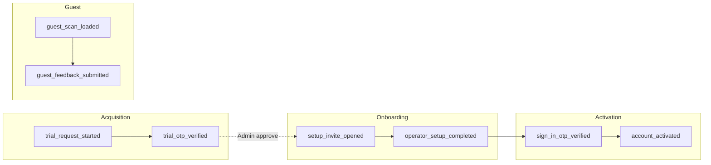

# Analytics and event map

How usage is measured today and the **Target** instrumentation spec for funnels.

## Status summary

| Feature | Status |
|---------|--------|
| Google Analytics 4 (gtag) | Shipped (requires `VITE_GA_MEASUREMENT_ID`; no-op when unset) |
| Cookie consent gating | Shipped |
| Page views | Shipped |
| Custom events | Planned |
| Funnel dashboards | Planned |
| Server-side analytics | Planned |

## Domain terms

| Term | Definition |
|------|------------|
| **Consent** | User choice in cookie banner — analytics runs only when accepted |
| **page_view** | GA config hit on route change with `page_path` |

---

## Analytics stack

| | |
|---|---|
| **Status** | Shipped |
| **Compliance** | Cookie Policy; reject non-essential blocks GA |
| **Launch blocker** | None if consent flow kept |

### Components

| Piece | Location |
|-------|----------|
| GA measurement ID | `VITE_GA_MEASUREMENT_ID` env — analytics disabled when empty |
| Consent store | `cookieConsentStore.ts` |
| Init + page views | `analytics.ts`, `GoogleAnalytics.tsx` |
| Banner | `CookieConsentBanner.tsx` |

### Behaviour

1. User accepts cookies → `setAnalyticsConsent(true)` → load gtag script.
2. On route change (`pathname`, `search`, `hash`) → `trackPageView` if consent granted.
3. Reject → `ga-disable-{id}` flag; no script load.

---

## Shipped events

| Event | Properties | Fires where | Status |
|-------|------------|-------------|--------|
| `page_view` (gtag config) | `page_path` | All routes after consent | Shipped |
| `cookie_consent_granted` | — | Not implemented as named event | — |
| `cookie_consent_rejected` | — | Not implemented as named event | — |

**Implicit:** First `page_view` after accept fires for current route only.

### Routes generating page_view (when consented)

| Path pattern | Context |
|--------------|---------|
| `/` | Marketing homepage |
| `/privacy`, `/terms`, `/cookie-policy` | Legal |
| `/login`, `/forgot-password`, `/reset-password` | Auth |
| `/setup-account*` | Operator Setup |
| `/single-dashboard`, `/multi-dashboard`, `/admin-dashboard` | Dashboards |
| `/scan/:token` | Guest feedback |

---

## Target events (Planned)

Priority for implementation. Not fired in codebase today.

### Acquisition funnel

| Event | Properties | Funnel step | Intended fire location | Priority |
|-------|------------|-------------|------------------------|----------|
| `trial_request_started` | — | Acquisition | `HeroTrialForm` submit | P1 |
| `trial_otp_sent` | — | Acquisition | After `request-trial` success | P1 |
| `trial_otp_verified` | — | Acquisition | `HeroTrialOtpStep` success | P1 |
| `trial_request_success_view` | — | Acquisition | `HeroTrialSuccessStep` mount | P2 |

### Onboarding funnel

| Event | Properties | Funnel step | Intended fire location | Priority |
|-------|------------|-------------|------------------------|----------|
| `setup_invite_opened` | `account_type` | Onboarding | `validate-invite` success | P1 |
| `operator_setup_step_completed` | `step`, `account_type` | Onboarding | Each wizard step | P1 |
| `operator_setup_completed` | `account_type`, `location_count` | Onboarding | `GuestLoopReadyStep` success | P1 |
| `activation_code_generated` | — | Onboarding | Phase 3 complete | P2 |

### Activation funnel

| Event | Properties | Funnel step | Intended fire location | Priority |
|-------|------------|-------------|------------------------|----------|
| `sign_in_started` | — | Activation | `SignInForm` submit | P1 |
| `sign_in_otp_verified` | `channel` | Activation | OTP success | P1 |
| `account_activated` | — | Activation | `SignInActivationCodeStep` success | P1 |
| `activation_expired_shown` | — | Activation | Sign-in error for expired | P2 |

### Operator product

| Event | Properties | Funnel step | Intended fire location | Priority |
|-------|------------|-------------|------------------------|----------|
| `smart_guest_link_copied` | `location_id` | Engagement | Home copy Smart Guest Link | P2 |
| `dashboard_location_switched` | `location_id` | Engagement | Multi dashboard switcher | P3 |

### Guest

| Event | Properties | Funnel step | Intended fire location | Priority |
|-------|------------|-------------|------------------------|----------|
| `guest_scan_loaded` | — | Guest | `GuestFeedbackPage` metadata OK | P1 |
| `guest_feedback_submitted` | `contact_type` | Guest | Form success | P1 |
| `guest_feedback_rate_limited` | — | Guest | 429 handler | P3 |

### Admin

| Event | Properties | Funnel step | Intended fire location | Priority |
|-------|------------|-------------|------------------------|----------|
| `trial_approved` | `trial_request_id` | Admin | Approve confirm | P2 |
| `trial_declined` | — | Admin | Decline confirm | P2 |
| `activation_extended` | `user_id` | Admin | Extend activation | P3 |

---

## Funnels (Target)

**Shipped measurement today:** only route-level `page_view` — funnels must be approximated manually in GA4 until Target events ship.

---

## Cross-reference rule

Other `docs/product/*.md` screen tables use:

- Shipped: `page_view`
- Planned: event name with `(Planned)` suffix

---

## Not yet live

| Item | Status |
|------|--------|
| Custom gtag events | Planned |
| GA4 funnel explorations (configured) | Planned |
| Server-side / product analytics DB | Planned |
| Consent mode v2 advanced | Planned |
| Error tracking (Sentry etc.) | Planned |

## Implementation notes

- To add events: extend `analytics.ts` with `trackEvent(name, params)` called behind consent check
- Do not fire PII in event properties (email, phone, guest name)
