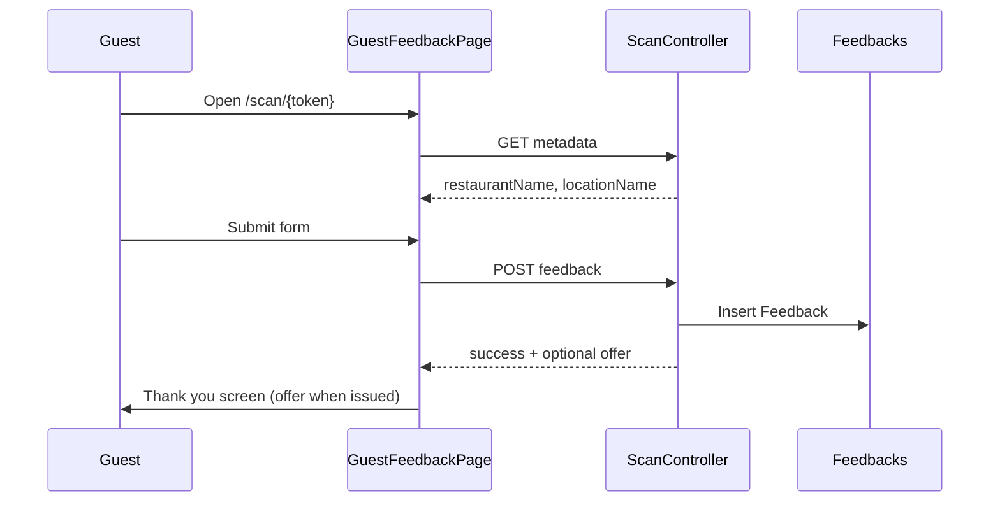

# Guest capture form

The **Private feedback form** shown when a guest opens a **Smart Guest Link** (`/scan/{token}`). Standard for all locations — only Location name, Address, and Brand logo differ.

## Status summary

| Feature | Status |
|---------|--------|
| Token resolution | Shipped |
| Feedback + guest details cards | Shipped |
| Thank-you screen | Shipped |
| Terms & Conditions and Privacy Notice links | Shipped |
| Offers opt-out | Shipped (write-only) |
| Per-location form configuration | Planned (not in scope) |
| Issue tags / ratings | Planned |
| Post-submit offers | Shipped (catalog thank-you attach + Issue + paint) |
| Custom thank-you message | Planned |

## Domain terms

| Term | Definition |
|------|------------|
| **Smart Guest Link** | Operator-facing name for the Smart Guest **QR link** (`/scan/{token}`) for one **Owned location** |
| **QR link** | Public URL/token for one **QR code**; peers share the same route shape |
| **Private feedback form** | Guest-facing form: message, name, contact, and Offers opt-out — not posted publicly |
| **Offers opt-out** | Boolean on Feedback recording whether the guest prefers not to receive offers |
| **QR code** | Per-location instance of a **QR type** with its own token; operators do not download PNGs — stickers via **Tummly Shop** |

---

## Smart Guest Link entry

| | |
|---|---|
| **Status** | Shipped |
| **Launch blocker** | None |

### User flow

1. Guest scans QR or opens link → `/scan/{token}`.
2. `GuestFeedbackPage` loads → `GET /api/scan/{token}`.
3. Resolves an Active `QrCode` token; returns `restaurantName`, `locationName`, and `address`. The form displays Location name and Address, not `restaurantName`.
4. Unknown or inactive (Paused/Archived) token → same not-found screen (status not leaked).
5. Feedback submit stores `QrCodeId` for source attribution.

### Backend actions

| Endpoint | Auth | Purpose |
|----------|------|---------|
| `GET /api/scan/{token}` | None | Resolve metadata |
| `POST /api/scan/{token}/feedback` | None | Create `Feedback` row |

Token is the secret; no JWT.

### Edge cases

| Case | Behaviour |
|------|-----------|
| Empty token | Not found |
| Unknown token | 404 — API: `"Link not found."`; UI default: `"This link was not found or is no longer active."` |
| Empty token | 404 — `"Invalid link."` |
| Network error on load | Error message on not-found component |

### Entry points

`GuestFeedbackPage.tsx` → `scanApi.ts` → `ScanController` → `SmartGuestLinkService`

---

## Location header

| | |
|---|---|
| **Status** | Shipped |
| **Launch blocker** | None |

### Screen content

| Element | Source |
|---------|--------|
| Brand logo | Shared placeholder used by the Owned-location switcher until Brand logo upload ships |
| Venue line 1 | `{locationName}` |
| Venue line 2 | `{address}` from `RestaurantLocation.Address`; omitted when blank |
| Title | "Tell us about your experience" |
| Subtitle | Feedback is private to the team at `{locationName}, {address}` and they may follow up using the supplied contact details |

Rendered in `GuestFeedbackForm.tsx` from API metadata.

---

## Feedback form fields

| | |
|---|---|
| **Status** | Shipped |
| **Launch blocker** | None |
| **Compliance** | `Terms & Conditions · Privacy Notice` links; pre-checked Offers opt-out is an intentional product trade-off |

### Fields

| Field | UI | Validation | Max length |
|-------|----|------------|------------|
| `comment` | First card; placeholder "Add your own feedback…"; speech-to-text mic (while recording, the mic expands to a full-width strip: cancel ✕, audio-reactive waveform, confirm ✓; static bars under reduced motion or without Web Audio) | Required | 1000 |
| `guestName` | Placeholder "Your name" in Your details card | Required | 150 |
| `guestContact` | Placeholder "Email or phone number" in Your details card | Required; email format or UK phone | 100 |
| `acceptsOffers` | Pre-checked checkbox; untick to opt out | Boolean; checked by default | — |

### Permissions

Public — no sign-in.

### Data created

`Feedbacks` row: `RestaurantLocationId`, `GuestName`, `GuestContact`, `ContactType` (heuristic: Email / Phone / Unknown), `Comment`, `OffersOptOut`, `CreatedAt`.

The client maps the positive UI field to storage: checked `acceptsOffers` → `OffersOptOut = false`; unchecked → `OffersOptOut = true`. An omitted API field defaults to `false`.

### Backend validation

Required fields and max lengths (150/100/1000). **Contact format** (email or UK phone) is enforced on the **client only** — direct API calls may store free-text contacts.

### Rate limiting

10 submissions per token per hour (in-memory cache on server).

### Edge cases

| Case | Behaviour |
|------|-----------|
| Rate limit exceeded | 429 — try again later |
| Submit while offline | Client error message; retry clears error |
| Contact with `@` invalid email | Client Zod rejection |
| Phone not UK-valid | Client Zod rejection |

### Analytics

| Event | Status |
|-------|--------|
| `page_view` on `/scan/:token` | Shipped (if site GA consent — guest route still loads GA component globally) |
| `guest_feedback_submitted` | Planned |

**Note:** Guest route is outside `MainLayout` but `GoogleAnalytics` wraps entire app in `AppRoutes` — page views fire when user has accepted cookies on marketing site then navigates to scan URL in same browser session.

### Entry points

`GuestFeedbackForm.tsx` → `guestFeedbackSchema.ts` → `submitGuestFeedback` in `scanApi.ts`

---

## Thank-you message

| | |
|---|---|
| **Status** | Shipped |
| **Launch blocker** | None |

### Content (after successful submit)

- **Heading:** "Thank you."
- **Body:** "Your feedback has been shared with the team at `{locationName}`, `{address}`."
- **Offer (optional):** when submit issues a live Guest form thank-you catalog Offer, the thank-you screen paints Offer claim QR, title, description, Claim code, Copy (enabled), and expiry. When issue is skipped (no attach, non-Active attach, or Offers opt-out), the screen stays plain thank-you (`offer: null`).

Capture Guest experience preview Thank you tab shows a sample coupon (`PREVIEW-CODE`, Copy disabled) when a live thank-you attach with title is present. No Issue is created from preview.

### Planned

- Configurable `ThankYouMessage` per restaurant (`GuestLoopSetup` column exists, unused)

Component: `GuestFeedbackSuccess.tsx`

---

## Offers (post-feedback)

| | |
|---|---|
| **Status** | Shipped (catalog thank-you attach) |
| **Launch blocker** | Soft — marketing FAQ mentions offers separately |

### Target

- Offer headline/details from the location’s live **Guest form thank-you attach**
- Redemption via Staff Redeem of the issued **Offer Claim code** / **Offer claim QR**

### Shipped today

The form captures Offers opt-out. On successful submit with a live Active thank-you attach and the guest not opted out, `POST /api/scan/{token}/feedback` creates an **Offer issue** and returns `offer: { title, description, claimCode, expiryLabel }`. The thank-you screen paints that offer. Opt-out / paused / null attach still succeed with `offer: null`.

---

## Operator view of feedback

| | |
|---|---|
| **Status** | Partial |
| **Launch blocker** | None |

Operators see total count + 5 recent items per location on dashboard (`GET /api/feedback?locationId=`). No inbox workflow, tags, or recovery actions.

See operator dashboard in [operator-setup.md](./operator-setup.md).

---

## Flow diagram

## Not yet live

| Item | Status |
|------|--------|
| Guest list opt-in on form | Planned — FAQ claims opt-in |
| Issue tags / star rating | Planned — Services marketing copy |
| Per-location thank-you / offers | Planned — `GuestLoopSetup` fields |
| Guest-facing privacy policy link | Shipped — Terms + Privacy Notice on form |
| reCAPTCHA / bot protection | Planned — rate limit only |

## Implementation notes

- ADR: feedback shape `docs/adr/0003-feedback-model-shape.md`
- ADR: opaque token `docs/adr/0001-smart-guest-link-uses-opaque-token.md`
