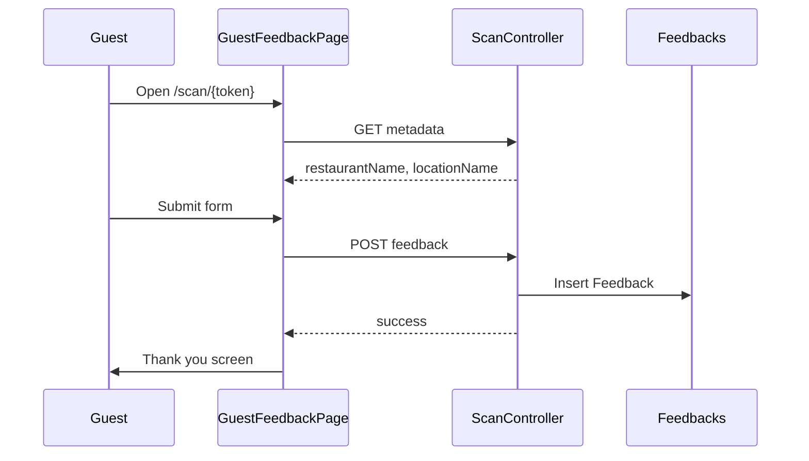

# Guest capture form

The **private feedback form** shown when a guest opens a **Smart Guest Link** (`/scan/{token}`). Standard for all locations — only restaurant/location name differs.

## Status summary

| Feature | Status |
|---------|--------|
| Token resolution | Shipped |
| Three-field feedback form | Shipped |
| Thank-you screen | Shipped |
| Terms and Privacy Notice on form | Shipped |
| Per-location form configuration | Planned (not in scope) |
| Guest list opt-in checkbox | Planned |
| Issue tags / ratings | Planned |
| Post-submit offers | Planned |
| Custom thank-you message | Planned |

## Domain terms

| Term | Definition |
|------|------------|
| **Smart Guest Link** | Public URL encoding opaque `LinkToken` for one **Owned location** |
| **Private feedback form** | Guest-facing form: name, contact, message — not posted publicly |
| **QR code** | PNG encoding the Smart Guest Link; operator downloads from dashboard |

---

## Smart Guest Link entry

| | |
|---|---|
| **Status** | Shipped |
| **Launch blocker** | None |

### User flow

1. Guest scans QR or opens link → `/scan/{token}`.
2. `GuestFeedbackPage` loads → `GET /api/scan/{token}`.
3. Returns `restaurantName`, `locationName`.
4. Invalid token → not-found screen.

### Backend actions

| Endpoint | Auth | Purpose |
|----------|------|---------|
| `GET /api/scan/{token}` | None | Resolve metadata |
| `POST /api/scan/{token}/feedback` | None | Create `Feedback` row |

Token is the secret; no JWT.

### Edge cases

| Case | Behaviour |
|------|-----------|
| Empty token | Not found |
| Unknown token | 404 — API: `"Link not found."`; UI default: `"This link was not found or is no longer active."` |
| Empty token | 404 — `"Invalid link."` |
| Network error on load | Error message on not-found component |

### Entry points

`GuestFeedbackPage.tsx` → `scanApi.ts` → `ScanController` → `SmartGuestLinkService`

---

## Restaurant header

| | |
|---|---|
| **Status** | Shipped |
| **Launch blocker** | None |

### Screen content

| Element | Source |
|---------|--------|
| Title | "Share private feedback with {restaurantName}" |
| Subtitle | "Tell the team at {locationName} what you thought." (or generic if no location name) |

Rendered in `GuestFeedbackForm.tsx` from API metadata.

---

## Feedback form fields

| | |
|---|---|
| **Status** | Shipped |
| **Launch blocker** | None |
| **Compliance** | Terms acceptance copy; link to `/terms` |

### Fields

| Field | Label | Validation | Max length |
|-------|-------|------------|------------|
| `guestName` | Your name | Required | 150 |
| `guestContact` | Email or phone number | Required; email format or UK phone | 100 |
| `comment` | Leave your feedback | Required | 1000 |

### Permissions

Public — no sign-in.

### Data created

`Feedbacks` row: `RestaurantLocationId`, `GuestName`, `GuestContact`, `ContactType` (heuristic: Email / Phone / Unknown), `Comment`, `CreatedAt`.

### Backend validation

Required fields and max lengths (150/100/1000). **Contact format** (email or UK phone) is enforced on the **client only** — direct API calls may store free-text contacts.

### Rate limiting

10 submissions per token per hour (in-memory cache on server).

### Edge cases

| Case | Behaviour |
|------|-----------|
| Rate limit exceeded | 429 — try again later |
| Submit while offline | Client error message; retry clears error |
| Contact with `@` invalid email | Client Zod rejection |
| Phone not UK-valid | Client Zod rejection |

### Analytics

| Event | Status |
|-------|--------|
| `page_view` on `/scan/:token` | Shipped (if site GA consent — guest route still loads GA component globally) |
| `guest_feedback_submitted` | Planned |

**Note:** Guest route is outside `MainLayout` but `GoogleAnalytics` wraps entire app in `AppRoutes` — page views fire when user has accepted cookies on marketing site then navigates to scan URL in same browser session.

### Entry points

`GuestFeedbackForm.tsx` → `guestFeedbackSchema.ts` → `submitGuestFeedback` in `scanApi.ts`

---

## Thank-you message

| | |
|---|---|
| **Status** | Shipped (static copy) |
| **Launch blocker** | None |

### Content (after successful submit)

- **Heading:** "Thank you."
- **Body:** "Your feedback is private. It's shared only with the restaurant team and won't be posted publicly."

No offer, no opt-in prompt, no redirect.

### Planned

- Configurable `ThankYouMessage` per restaurant (`GuestLoopSetup` column exists, unused)
- Offer reveal after submit
- Guest list opt-in

Component: `GuestFeedbackSuccess.tsx`

---

## Offers (post-feedback)

| | |
|---|---|
| **Status** | Planned |
| **Launch blocker** | Soft — marketing FAQ mentions offers separately |

### Target

- Offer headline/details from `GuestLoopSetup`
- Redemption flow for guest

### Shipped today

None on guest form.

---

## Operator view of feedback

| | |
|---|---|
| **Status** | Partial |
| **Launch blocker** | None |

Operators see total count + 5 recent items per location on dashboard (`GET /api/feedback?locationId=`). No inbox workflow, tags, or recovery actions.

See operator dashboard in [operator-setup.md](./operator-setup.md).

---

## Flow diagram

## Not yet live

| Item | Status |
|------|--------|
| Guest list opt-in on form | Planned — FAQ claims opt-in |
| Issue tags / star rating | Planned — Services marketing copy |
| Per-location thank-you / offers | Planned — `GuestLoopSetup` fields |
| Guest-facing privacy policy link | Shipped — Terms + Privacy Notice on form |
| reCAPTCHA / bot protection | Planned — rate limit only |

## Implementation notes

- ADR: feedback shape `docs/adr/0003-feedback-model-shape.md`
- ADR: opaque token `docs/adr/0001-smart-guest-link-uses-opaque-token.md`
