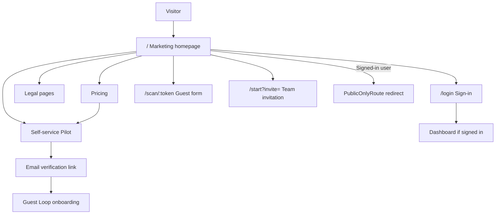

# Marketing site

Public pages that explain Tummly and drive **Self-service Pilot** and **Sign-in**. Legal pages are accessible without authentication. Joining an existing restaurant is a distinct path — see [team.md](./team.md).

## Status summary

| Area | Status |
|------|--------|
| Marketing homepage sections | Shipped (copy/CTA alignment to Self-service Pilot Planned) |
| Self-service Pilot entry (Home / Pricing) | Planned — see [self-service-pilot.md](./self-service-pilot.md) |
| Pricing page | Planned (Figma); public plan comparison |
| Legal pages (Privacy, Terms, Cookie Policy) | Shipped |
| Cookie consent banner | Shipped |
| PublicOnlyRoute (redirect signed-in users) | Partial — redirects `ADMIN` and `USER` with `accountType`; signed-in `USER` without `accountType` may still view `/` |
| Product capability claims vs shipped features | Partial — several **Overstated** claims (see Claims register) |
| Legacy HeroTrialForm / `/#request-trial` as public path | Retired — demo/sales Trial Request only |

## Domain terms

| Term | Definition |
|------|------------|
| **Marketing homepage** | Public landing page at `/` — Self-service Pilot entry, product sections, FAQs, footer |
| **Legal page** | Long-form Privacy (`/privacy`), Terms (`/terms`), or Cookie Policy (`/cookie-policy`) |
| **Cookie settings** | In-app dialog for analytics preference (not a route) |
| **Self-service Pilot** | Public path from marketing through onboarding; see [self-service-pilot.md](./self-service-pilot.md) |

---

## Site map

| Route | Page | Auth |
|-------|------|------|
| `/` | Marketing homepage | Public (`PublicOnlyRoute` — see status summary) |
| Pricing (route TBD at build) | Plan comparison → Self-service Pilot / paid stub | Public |
| `/privacy` | Privacy Policy | Public (no guard) |
| `/terms` | Terms of Service | Public |
| `/cookie-policy` | Cookie Policy | Public |
| `*` (unknown) | Not found (marketing chrome + Go Home) | Public |
| `/login` | Sign-in | Full-viewport; outside `MainLayout` |
| `/start?invite=` | Team invitation accept | Public — see [team.md](./team.md) |
| `/scan/:token` | Guest feedback | Public; outside `PublicOnlyRoute` |
| `/setup-account-*` | Demo/sales **Operator Setup** (invite token) | Public under `PublicOnlyRoute` — see [operator-setup.md](./operator-setup.md) |

**Navbar / footer CTAs (locked intent):** Get started / Start 30-day Pilot → Self-service Pilot; Log in / Sign in → `/login`. Demo/sales **Get a demo** / Contact us may remain sales-led.

---

## Hero (Self-service Pilot entry)

| | |
|---|---|
| **Status** | Planned (Figma Home `4057:909`) |
| **Launch blocker** | Soft until build |
| **Compliance** | Account create requires Terms acceptance |

### Copy (key)

- Work email + **Get started**
- **Continue with Google** / **Continue with Microsoft**
- Trust: No card required · No automatic paid renewal

### CTAs

| Control | Action |
|---------|--------|
| Get started / work email | Start **Self-service Pilot** → Email verification → Guest Loop onboarding |
| Continue with Google / Microsoft | Social start (may skip Email verification) |
| Mid-page Start 30-day Pilot / Choose plan | Pricing strip → same path or paid stub |

### Distinct path

Invitee Create an account (join existing restaurant) is **Team invitation** accept — not this hero. Short note only; full path in [team.md](./team.md).

### Claims note

Product sections may still overstate Planned capabilities — see Claims register.

### Analytics

`page_view` (after cookie consent). Self-service acquisition events: Planned — see [analytics.md](./analytics.md).

---

## Pricing

| | |
|---|---|
| **Status** | Planned (Figma `4100:11394`) |

### Content

Headline around Locations and usage. Monthly / Annual toggle. Plan cards Pilot / Starter / Growth / Group.

### CTAs

| Control | Action |
|---------|--------|
| Start 30-day Pilot | Self-service Pilot (Pilot happy path) |
| Choose Starter / Growth / Group | Paid stub (checkout later pack) |

---

## Why Tummly? (`About`)

| | |
|---|---|
| **Status** | Shipped (UI) |
| **Launch blocker** | Soft — cards describe **Planned** capabilities |

### Sections

Three cards: guest list from touchpoints; private feedback; return offers with controls.

### CTAs

None — informational.

---

## Built for hospitality (`Hospitality`)

| | |
|---|---|
| **Status** | Shipped |
| **Launch blocker** | Soft |

### Content

Carousel: takeaways, cafés, casual dining, multi-site — vertical positioning copy.

### CTAs

None.

---

## What Tummly gives your restaurant (`Services`)

| | |
|---|---|
| **Status** | Shipped (UI) |
| **Launch blocker** | **Hard** — grid describes many **Planned** features as present |

### Content

Nine service tiles: Smart Guest Links, feedback form, guest list, inbox, offers, templates, campaigns, AI brief, consent controls.

### CTAs

None.

### Claims note

Most tiles exceed **Shipped** operator workspace — see Claims register rows for Services section.

---

## Choose setup / plan CTAs (`Setup`)

| | |
|---|---|
| **Status** | Shipped UI; CTA target Planned |
| **Launch blocker** | Soft |

### CTAs (locked intent)

| Button | Action |
|--------|--------|
| Start single-location / Pilot | Self-service Pilot |
| Multi-location / paid | Self-service Pilot plan choice or paid stub |

Legacy “Request trial → `/#request-trial`” is not the public path.

### Copy claims

Single card: "one starter offer and a weekly brief" — **Overstated** for starter offer; weekly brief **Partial** (see Claims register / `CONTEXT.md` **Weekly brief**).  
Multi card: "team roles and shared reporting" — **Partial** / **Planned**.

---

## Product tour / inclusions carousel

| | |
|---|---|
| **Status** | Shipped (UI) |
| **Launch blocker** | **Hard** for starter QR / workspace claims |

### Content

Slides describing Pilot / product inclusions (workspace, starter QR, links, feedback, offers, allowance, AI brief, support). Align copy to Self-service Pilot + **Activation fulfilment** (not admin-gated Trial Request).

### Trust copy

"No payment / no card required" on Pilot start — Accurate for Pilot path (no billing on Pilot choice).  
"Reorders, premium branded print packs…" — **Planned** fulfilment paths.

### CTAs

None in section (or Start 30-day Pilot → Self-service Pilot).

---

## How access works (Guided access / steps)

| | |
|---|---|
| **Status** | Shipped UI; steps Planned rewrite |
| **Launch blocker** | Soft |

### Steps (locked intent)

1. Get started from Home or Pricing — Self-service Pilot  
2. Verify email (link; social may skip)  
3. Guest Loop onboarding (account → restaurant → Location → plan) → provisioning → Sign-in → Activation  

Legacy “Request guided access → await admin review → Operator Setup” is demo/sales only.

### Footer copy

References to starter QR / offer guidance after workspace — **Partial** / **Planned**.

### CTAs

None.

---

## FAQs (`Faqs`)

| | |
|---|---|
| **Status** | Shipped |
| **Launch blocker** | **Hard** — FAQ answers list **Planned** features as included |

### Notable FAQ claims

| FAQ | Accuracy |
|-----|----------|
| No app for guests | Accurate — web form at `/scan/:token` |
| No POS change required | Accurate |
| After Get started | Align to Self-service Pilot (not admin review wait) |
| Pilot / trial inclusion | **Overstated** — guest list, offers, campaigns, starter QR (weekly brief **Partial**) |
| No charge on Pilot start | Accurate for Pilot path |
| Public reviews | Accurate policy copy — do not gate public reviews |

### CTAs

Accordion only.

---

## CTA launch (`CTALaunch`)

| | |
|---|---|
| **Status** | Shipped UI; CTA target Planned |
| **Launch blocker** | Soft — "first return offer" in copy |

### CTAs

| Control | Action |
|---------|--------|
| Start Pilot / Get started | Self-service Pilot |
| Sign in / Log in | `/login` |

### Trust copy

"No payment / no card required" — **Accurate** for Pilot.

---

## Footer

| | |
|---|---|
| **Status** | Shipped |

### CTAs

Get started / Start Pilot, Sign in, Privacy, Terms, Cookie Policy, Cookie settings (dialog). Demo/sales Contact / Get a demo optional.

---

## Cookie consent

| | |
|---|---|
| **Status** | Shipped |
| **Compliance** | Cookie Policy page; consent before Google Analytics |

### Behaviour

- Banner until choice stored (`cookieConsentStore`)
- Accept all → analytics enabled
- Reject non-essential → no GA
- Cookie settings opens preference dialog (`cookieSettingsUiStore`); banner hides while open and returns if closed without saving
- `/cookie-settings` is not a page (404)

### Analytics

Consent gates `initGoogleAnalytics` and `trackPageView`.

---

## Flow diagram

---

## Claims register

Marketing claims audited against **Shipped** product (2026.07.01). Update CTAs and “after request / await review” claims when Self-service Pilot ships.

| Claim | Section | Status | Shipped backing | Launch blocker |
|-------|---------|--------|-----------------|----------------|
| No payment / no card on Pilot start | Hero, Pricing, CTA, FAQ | Accurate (intent) | No billing on Pilot | None |
| Private feedback via QR/link | Hero, Services, FAQ | Accurate | `/scan/:token` form | None |
| Guest must not download app | FAQ | Accurate | Mobile web form | None |
| No POS replacement required | FAQ | Accurate | — | None |
| Admin trial review before setup | Legacy GuidedAccess / FAQ | **Demo/sales only** — not public Self-service Pilot | Admin approve flow | Soft — remove from public copy |
| Starter QR materials included / shipped | Tour, access steps, FAQ | **Overstated** | Activation Code + digital QR download only | **Hard** — change copy or ship packs |
| Guest list / opt-in on feedback form | Services, FAQ, About | **Overstated** | Feedback captures contact; no guest list CRM | **Hard** for "guest list" promises |
| Issue tags on feedback | Services, About | **Overstated** | Comment field only | Soft |
| Offers, campaigns, templates | Services, tour, Setup | **Overstated** | No operator UI | **Hard** if marketed as Pilot inclusion |
| AI weekly brief | Services, tour | **Partial** | Operator Home **Weekly brief** (`CONTEXT.md`) | Soft |
| Email/SMS campaigns with credits | Services, tour | **Overstated** | SMS OTP for operators only | Soft |
| Team roles / shared reporting (multi) | Setup, Hospitality | **Partial** | Multi dashboard basic; Team & permissions Planned | Soft |
| "One starter offer" (single setup card) | Setup | **Overstated** | None | **Hard** |
| Guided launch / offer preparation | CTALaunch, access steps | **Partial** | Human onboarding implied; no in-app offer builder | Soft |
| Do not manipulate public reviews | FAQ | Accurate | Policy statement | None — keep |

**Hard blockers** are summarized in [README.md](./README.md#status-summary) and should be resolved before broad public launch or paid marketing.

## Not yet live

| Item | Status |
|------|--------|
| Self-service Pilot marketing chrome + routes | Planned |
| Marketing claims alignment pass | Planned — legal/marketing review |
| A/B testing or personalization | Planned |
| Interactive cookie preference centre | Shipped — banner + Cookie settings dialog with analytics toggle and Save |

## Implementation notes

- Section order today: `HomePage.tsx` — Hero → About → Hospitality → Services → Setup → GuidedTrial → GuidedAccess → FAQs → CTALaunch → Footer
- Replace Trial Request scroll helpers (`RequestTrialLink` / `scrollToRequestTrial.ts`) when Self-service Pilot builds
- Figma file: Marketing Website `UP1DqyGGGrxx80Dp7jReTT`
