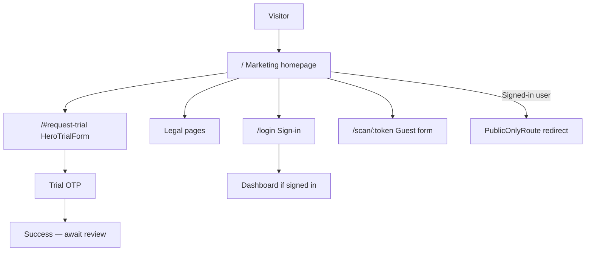

# Marketing site

Public pages that explain Tummly and drive **Trial Request** and **Sign-in**. Legal pages are accessible without authentication.

## Status summary

| Area | Status |
|------|--------|
| Marketing homepage sections | Shipped |
| Trial Request embedded in hero | Shipped |
| Legal pages (Privacy, Terms, Cookie Policy) | Shipped |
| Cookie consent banner | Shipped |
| PublicOnlyRoute (redirect signed-in users) | Partial — redirects `ADMIN` and `USER` with `accountType`; signed-in `USER` without `accountType` may still view `/` |
| Product capability claims vs shipped features | Partial — several **Overstated** claims (see Claims register) |

## Domain terms

| Term | Definition |
|------|------------|
| **Marketing homepage** | Public landing page at `/` — hero, product sections, FAQs, footer |
| **Legal page** | Long-form Privacy (`/privacy`), Terms (`/terms`), or Cookie Policy (`/cookie-policy`) — informational, not an interactive preference centre |
| **Cookie settings** | In-app dialog for analytics preference (not a route) |
| **Trial Request** | Application form in hero; see [trial-request.md](./trial-request.md) |

---

## Site map

| Route | Page | Auth |
|-------|------|------|
| `/` | Marketing homepage | Public (`PublicOnlyRoute` — see status summary) |
| `/#request-trial` | Scroll to hero form | Public |
| `/privacy` | Privacy Policy | Public (no guard) |
| `/terms` | Terms of Service | Public |
| `/cookie-policy` | Cookie Policy | Public |
| `*` (unknown) | Not found (marketing chrome + Go Home) | Public |
| `/login` | Sign-in | Full-viewport; outside `MainLayout` |
| `/scan/:token` | Guest feedback | Public; outside `PublicOnlyRoute` |
| `/register/single`, `/register/multi` | Operator Setup (dev/direct; invite links use `/setup-account-*`) | Public under `PublicOnlyRoute` |

**Navbar / footer CTAs:** Request trial → `/#request-trial`; Sign in → `/login`.

---

## Hero (`#request-trial`)

| | |
|---|---|
| **Status** | Shipped |
| **Launch blocker** | None |
| **Compliance** | Trial form requires Terms acceptance |

### Copy (key)

- **Headline:** "Turn every order into a direct guest relationship."
- **Subcopy:** QR prompts, private feedback, guest list, return offers, weekly visibility.

### CTAs

| Control | Action |
|---------|--------|
| Embedded **HeroTrialForm** | Submit → OTP flow (see [trial-request.md](./trial-request.md)) |
| (No separate hero button) | Form is the primary CTA |

### Post-click

Submit → OTP step → verify → success message (review expectations).

### Claims note

Subcopy references **guest list**, **return offers**, **weekly** insights — mostly **Planned** in operator product (see Claims register).

### Analytics

`page_view` (after cookie consent); `/#request-trial` included in path when hash present.

---

## Why Tummly? (`About`)

| | |
|---|---|
| **Status** | Shipped (UI) |
| **Launch blocker** | Soft — cards describe **Planned** capabilities |

### Sections

Three cards: guest list from touchpoints; private feedback; return offers with controls.

### CTAs

None — informational.

---

## Built for hospitality (`Hospitality`)

| | |
|---|---|
| **Status** | Shipped |
| **Launch blocker** | Soft |

### Content

Carousel: takeaways, cafés, casual dining, multi-site — vertical positioning copy.

### CTAs

None.

---

## What Tummly gives your restaurant (`Services`)

| | |
|---|---|
| **Status** | Shipped (UI) |
| **Launch blocker** | **Hard** — grid describes many **Planned** features as present |

### Content

Nine service tiles: Smart Guest Links, feedback form, guest list, inbox, offers, templates, campaigns, AI brief, consent controls.

### CTAs

None.

### Claims note

Most tiles exceed **Shipped** operator workspace — see Claims register rows for Services section.

---

## Choose setup (`Setup`)

| | |
|---|---|
| **Status** | Shipped |
| **Launch blocker** | Soft |

### CTAs

| Button | Action |
|--------|--------|
| Request single-location trial | `/#request-trial` (same form; `locations` field captures count) |
| Request multi-location setup | `/#request-trial` |

### Copy claims

Single card: "one starter offer and a weekly brief" — **Overstated**.  
Multi card: "team roles and shared reporting" — **Partial** / **Planned**.

---

## Guided trial carousel (`GuidedTrial`)

| | |
|---|---|
| **Status** | Shipped (UI) |
| **Launch blocker** | **Hard** for starter QR / workspace claims |

### Content

Eight slides describing trial inclusions (workspace, starter QR, links, feedback, offers, allowance, AI brief, support).

### Trust copy (footer)

"No payment is taken when you request access" — **Accurate** (no billing integration).  
"Reorders, premium branded print packs…" — **Planned** fulfilment paths.

### CTAs

None in section.

---

## How guided access works (`GuidedAccess`)

| | |
|---|---|
| **Status** | Shipped |
| **Launch blocker** | None for steps 1–2; Soft for step 3 post-approval copy |

### Steps (accurate)

1. Request guided access — matches Trial Request  
2. Verify email — matches OTP  
3. Create workspace — matches Operator Setup after approval  

### Footer copy

References "starter QR materials, offer guidance" after workspace — **Partial** / **Planned**.

### CTAs

None.

---

## FAQs (`Faqs`)

| | |
|---|---|
| **Status** | Shipped |
| **Launch blocker** | **Hard** — FAQ answers list **Planned** features as included |

### Notable FAQ claims

| FAQ | Accuracy |
|-----|----------|
| No app for guests | Accurate — web form at `/scan/:token` |
| No POS change required | Accurate |
| After request | Accurate — matches trial flow |
| Guided trial inclusion | **Overstated** — guest list, offers, campaigns, weekly brief, starter QR |
| No charge on request | Accurate |
| Public reviews | Accurate policy copy — do not gate public reviews |

### CTAs

Accordion only.

---

## CTA launch (`CTALaunch`)

| | |
|---|---|
| **Status** | Shipped |
| **Launch blocker** | Soft — "first return offer" in copy |

### CTAs

| Control | Action |
|---------|--------|
| Request guided trial | `/#request-trial` |
| Sign in | `/login` |

### Trust copy

"No payment is taken when you request access" — **Accurate**.

---

## Footer

| | |
|---|---|
| **Status** | Shipped |

### CTAs

Request trial, Sign in, Privacy, Terms, Cookie Policy, Cookie settings (dialog).

---

## Cookie consent

| | |
|---|---|
| **Status** | Shipped |
| **Compliance** | Cookie Policy page; consent before Google Analytics |

### Behaviour

- Banner until choice stored (`cookieConsentStore`)
- Accept all → analytics enabled
- Reject non-essential → no GA
- Cookie settings opens preference dialog (`cookieSettingsUiStore`); banner hides while open and returns if closed without saving
- `/cookie-settings` is not a page (404)

### Analytics

Consent gates `initGoogleAnalytics` and `trackPageView`.

---

## Flow diagram

---

## Claims register

Marketing claims audited against **Shipped** product (2026.07.01).

| Claim | Section | Status | Shipped backing | Launch blocker |
|-------|---------|--------|-----------------|----------------|
| No payment on request | GuidedTrial, CTALaunch, FAQ | Accurate | No billing in app | None |
| Private feedback via QR/link | Hero, Services, FAQ | Accurate | `/scan/:token` form | None |
| Guest must not download app | FAQ | Accurate | Mobile web form | None |
| No POS replacement required | FAQ | Accurate | — | None |
| Trial review before setup | GuidedAccess, FAQ | Accurate | Admin approve flow | None |
| Starter QR materials included / shipped | GuidedTrial, GuidedAccess, FAQ | **Overstated** | Activation Code + digital QR download only | **Hard** — change copy or ship packs |
| Guest list / opt-in on feedback form | Services, FAQ, About | **Overstated** | Feedback captures contact; no guest list CRM | **Hard** for "guest list" promises |
| Issue tags on feedback | Services, About | **Overstated** | Comment field only | Soft |
| Offers, campaigns, templates | Services, GuidedTrial, Setup | **Overstated** | No operator UI | **Hard** if marketed as trial inclusion |
| AI weekly brief | Services, GuidedTrial | **Overstated** | No brief feature | Soft |
| Email/SMS campaigns with credits | Services, GuidedTrial | **Overstated** | SMS OTP for operators only | Soft |
| Team roles / shared reporting (multi) | Setup, Hospitality | **Partial** | Multi dashboard basic; no roles | Soft |
| "One starter offer" (single setup card) | Setup | **Overstated** | None | **Hard** |
| Guided launch / offer preparation | CTALaunch, GuidedAccess | **Partial** | Human onboarding implied; no in-app offer builder | Soft |
| Do not manipulate public reviews | FAQ | Accurate | Policy statement | None — keep |

**Hard blockers** are summarized in [README.md](./README.md#status-summary) and should be resolved before broad public launch or paid marketing.

## Not yet live

| Item | Status |
|------|--------|
| Marketing claims alignment pass | Planned — legal/marketing review |
| A/B testing or personalization | Planned |
| Interactive cookie preference centre | Shipped — banner + Cookie settings dialog with analytics toggle and Save |

## Implementation notes

- Section order: `HomePage.tsx` — Hero → About → Hospitality → Services → Setup → GuidedTrial → GuidedAccess → FAQs → CTALaunch → Footer
- Scroll helper: `RequestTrialLink` / `scrollToRequestTrial.ts`
