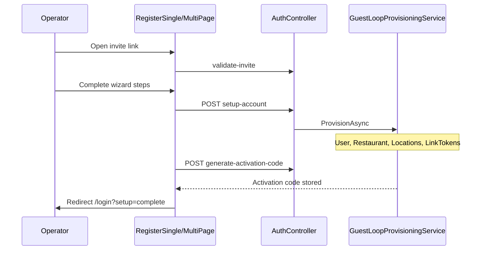

# Operator Setup (sign-up)

Post-approval flow where an invited operator creates an **Account password** and configures their workspace. Accessed via **Operator Setup invitation** link with `token` query parameter.

## Status summary

| Feature | Status |
|---------|--------|
| Invite token validation | Shipped |
| Single-location wizard (3 steps) | Shipped |
| Multi-location wizard (4 steps) | Shipped |
| Bulk location CSV upload | Shipped |
| Guest Loop provisioning animation | Shipped |
| Smart Guest Link token per location | Shipped |
| Activation Code generation (phase 3) | Shipped |
| Private feedback form (standard) | Shipped (same form all locations) |
| QR PNG at provisioning | Planned — on-demand download only |
| Per-location Starter QR materials | Planned |
| Setup complete / welcome email | Planned |
| Guest Loop offer/touchpoint configuration | Planned |

## Domain terms

| Term | Definition |
|------|------------|
| **Operator Setup** | Invite-driven wizard: credentials → restaurant/group → locations (multi) → **Guest Loop provisioning** |
| **Guest Loop provisioning** | Final step (Ready): backend prepares Smart Guest Links and Activation Code |
| **Guest Loop provisioning phases** | (1) Smart Guest Link — real API, (2) private feedback form — UI only, (3) Activation Code — real API |
| **Smart Guest Link** | Public URL `https://{frontend}/scan/{token}`; `token` = `RestaurantLocations.LinkToken` |
| **Owned location** | `RestaurantLocation` under operator's `Restaurant` |
| **Address** | Street-level venue address in Operator Setup — distinct from trial **Main location** |
| **Operator contact phone** | Optional UK phone; enables SMS Sign-in OTP when provided |
| **Location phone** | Optional per-location phone on `RestaurantLocation` |

---

## Invite entry and routing

| | |
|---|---|
| **Status** | Shipped |
| **Launch blocker** | None |

### User flow

1. User clicks email link → `/setup-account-single?token=` or `/setup-account-multi?token=`.
2. Alternate entry: `/setup-account?token=` (router validates then redirects to single/multi).
3. `RegisterSinglePage` / `RegisterMultiPage` validate token via `GET /api/auth/validate-invite`.
4. Invalid/expired/used token → error state.
5. Valid token → wizard with prefilled trial data.

### Backend actions

| Endpoint | Purpose |
|----------|---------|
| `GET /api/auth/validate-invite?token=` | Returns email, name, business, account type, category, etc. |

Token matched against `TrialRequest.ApprovalToken` (rotated on each send/resend).

Invite validity: 14 days from last send; token rotated on resend/reminder.

### Edge cases

| Case | Behaviour |
|------|-----------|
| Token expired | Bad request; user must request admin resend |
| Account already created for invite | Conflict |
| Token not approved | Bad request |

### Entry points

`SetupAccountPage.tsx`, `RegisterSinglePage.tsx`, `RegisterMultiPage.tsx` → `trialApi.ts` / `axiosInstance` → `GuestLoopProvisioningService`

---

## Single-location Operator Setup

| | |
|---|---|
| **Status** | Shipped |
| **Launch blocker** | None |

### User flow

| Step | Label | Content |
|------|-------|---------|
| 1 | Account | Full name (editable), email (read-only), **Account password** with **Password strength** (Good minimum), terms |
| 2 | Restaurant | Business name, category, restaurant phone, **Address** + postcode (lookup/reconciliation), business link |
| 3 | Ready | **Guest Loop provisioning** animation → redirect `/login?setup=complete` |

### States

| State | Meaning |
|-------|---------|
| Wizard in progress | Client state per step |
| Provisioning phase 1 loading | `setup-account` in flight |
| Provisioning phase 2 | Presentational delay |
| Provisioning phase 3 loading | `generate-activation-code` |
| Complete | Navigate to Sign-in |

### Backend actions (provisioning)

| Phase | Endpoint | Creates/updates |
|-------|----------|-----------------|
| 1 | `POST /api/auth/setup-account` | `User`, `Restaurant`, `RestaurantLocation`(s), `GuestLoopSetup`; `LinkToken` per location; `TrialRequest` → Account Created |
| 3 | `POST /api/auth/generate-activation-code` | `User.ActivationCodeHash`, encrypted copy for admin |

**No JWT issued** at end of setup — operator must **Sign-in** separately.

### Screens

| Screen | Route | Key fields | Data written |
|--------|-------|------------|--------------|
| Account | `/setup-account-single` | fullName, password, terms | — (on final provision: `Users`) |
| Restaurant | same | restaurantName, category, phone, address, postcode | `Restaurants`, `RestaurantLocations` |
| Ready | same | — | tokens, activation code |

### Edge cases

| Case | Behaviour |
|------|-----------|
| Single account with >1 location in payload | Backend BadRequest guard |
| Provisioning failure | Animation resets; error message shown |
| Password below Good | Client blocks submit |

### Entry points

`RegisterSinglePage.tsx` → `guest-loop/*` → `runProvisioningPhases.ts`

---

## Multi-location Operator Setup

| | |
|---|---|
| **Status** | Shipped |
| **Launch blocker** | None |

### User flow

| Step | Label | Content |
|------|-------|---------|
| 1 | Account | Same as single |
| 2 | Group | Group name, category, location count band, primary contact phone |
| 3 | Locations | Location cards and/or CSV bulk upload (template via `GET /api/auth/locations-upload-template`) |
| 4 | Ready | Same provisioning animation as single |

### Bulk upload

- Max 100 rows (`LOCATION_UPLOAD_MAX_ROWS`)
- Review dialog before commit
- Same address/postcode reconciliation as manual cards

### Entry points

`RegisterMultiPage.tsx`, `GuestLoopUploadLocationsDialog.tsx`, `locationUploadApi.ts`

---

## Smart Guest Link creation

| | |
|---|---|
| **Status** | Shipped |
| **Launch blocker** | None |

### Behaviour

- Each `RestaurantLocation` receives unique 32-character `LinkToken` at provisioning
- Guest URL built from `Frontend:BaseUrl` + `/scan/{token}`
- QR PNG **not** stored — generated on first operator download from dashboard

### Private feedback form

- **Standard for all locations** — same three fields: guest name, guest contact, message
- No per-location form configuration during setup
- Phase 2 of provisioning animation is **presentational only**

---

## Post-setup redirect

| | |
|---|---|
| **Status** | Partial |
| **Launch blocker** | Soft — no welcome email |

### User flow

Success → `navigate("/login?setup=complete")`.

### Planned

- **Setup complete / welcome email** — not sent today
- In-app welcome screen beyond query param — not implemented

---

## Flow diagram

## Not yet live

| Item | Status | Notes |
|------|--------|-------|
| Setup complete / welcome email | Planned | No template in `EmailTemplates/` |
| Starter QR materials (per location) | Planned | Phase 3 UI copy references; backend generates Activation Code only |
| GuestLoopSetup offer/touchpoint fields | Planned | Columns exist; provisioning leaves null |
| QR PNG at provision time | Planned | By design: lazy generation on download |
| Operator self-print PDF pack | Planned | — |

## Implementation notes

- Legacy: [guest-loop-audit.md](../guest-loop-audit.md)
- ADR: Smart Guest Link opaque token (`docs/adr/0001-*.md`)
