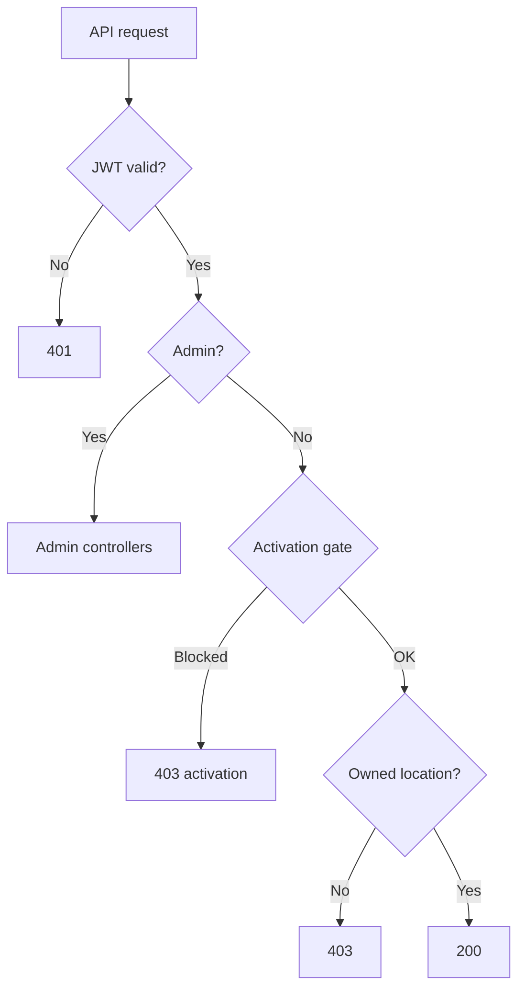

# Security, authentication, and RBAC

Roles, access control, session handling, and tenant isolation for Tummly.

## Status summary

| Feature | Status |
|---------|--------|
| JWT authentication | Shipped |
| Admin vs operator separation | Shipped |
| Activation gate | Shipped |
| Owned location isolation | Shipped |
| Invite token security | Shipped |
| Password hashing (BCrypt) | Shipped |
| Sign-in OTP | Shipped |
| Trusted device | Shipped |
| Failed login / account lock fields | Shipped — **5 attempts** → `IsLocked` (operators on `universal-login`; admins on `admin-login` only) |
| Guest feedback rate limit | Shipped |
| Address lookup rate limit | Shipped |
| Audit logging | Planned |
| Fine-grained permissions | Planned |
| MFA beyond OTP | Planned |

## Domain terms

| Term | Definition |
|------|------------|
| **Activation gate** | Middleware blocking operator APIs until **Account activation** or when **Activation expired** |
| **Owned location** | Location whose restaurant is owned by the signed-in operator |
| **Trusted device** | 30-day browser trust after Sign-in OTP |

---

## Roles

| | |
|---|---|
| **Status** | Shipped |
| **Launch blocker** | None |

### Permissions matrix

| Actor | Role claim | Access | Status |
|-------|------------|--------|--------|
| Platform admin | `Admin` (JWT claim) | `/api/admin/*`, admin dashboard | Shipped |
| Operator | `Owner` on `Users` (JWT claim); client session role `USER` | Operator APIs for **Owned location**s when activated | Shipped |
| Guest | None | `/api/scan/{token}/*` only | Shipped |
| Anonymous | None | Trial Request, address lookup, invite validate, setup-account | Shipped |

**No sub-roles** for operators today (no staff/manager RBAC).

### Entry points

- JWT: `JwtService.cs` — embeds role (`Admin` or `Owner`), user id
- Admin guard: `[Authorize(Roles = "Admin")]` on `AdminController`
- Frontend: `RoleRoute role="ADMIN"` for `/admin-dashboard` (session role `ADMIN`, mapped from admin JWT at login)

---

## Tenant isolation

| | |
|---|---|
| **Status** | Shipped |
| **Launch blocker** | None |

### Rules

- Operators access only locations where `Restaurant.OwnerUserId == authenticated User.Id`
- Enforced in `OwnedLocationService` + `OwnedLocationResponses` for feedback, QR endpoints
- `RestaurantController.GetLocations` scopes to owner's restaurant
- Guest access scoped by opaque `LinkToken` — no cross-location enumeration

### Edge cases

| Case | Response |
|------|----------|
| Operator requests another operator's `locationId` | 403 Forbidden |
| Guest uses wrong token | 404 Not found |
| Admin accesses operator data | Via admin APIs (trial/operator), not location impersonation |

---

## Session handling

| | |
|---|---|
| **Status** | Shipped |
| **Launch blocker** | None |

### Client

| Mechanism | Storage | Purpose |
|-----------|---------|---------|
| JWT | `authStore` (localStorage `tummly-auth`) | API Authorization header |
| Trusted device token | localStorage | Skip OTP on `universal-login` |
| Cookie consent | `cookieConsentStore` | Analytics only |

### Server

| Mechanism | Purpose |
|-----------|---------|
| JWT expiry | Configured in `JwtSettings` |
| `RefreshTokens` table | Refresh token support in schema |
| Sign out | Clears JWT client-side; keeps device token |

### Axios interceptors

| Status | Action |
|--------|--------|
| 401 | Clear session → `/login` |
| 403 `activationRequired` | Redirect `/login?step=activation-code` |
| 403 `activationExpired` | Clear session → `/login` |

`skipAuthRedirect` config option for `/auth/me` during routing.

---

## Sign-in security

| | |
|---|---|
| **Status** | Shipped |
| **Launch blocker** | None |

### Controls

- Password stored as BCrypt hash
- **Sign-in OTP** — 10-minute expiry (email template copy)
- **First Sign-in** always requires OTP
- **New device sign-in** notification email on OTP success
- **Activation expired** blocks login before JWT issued

### Partial

- `FailedLoginAttempts`, `IsLocked` on `User` and `Admin` — **5 failed password attempts** locks account. Operator lock enforced on `universal-login` operator path. **Admin lock not enforced on `universal-login`** (only on `admin-login`).

---

## Operator Setup link security

| | |
|---|---|
| **Status** | Shipped |
| **Launch blocker** | None |

### Controls

| Control | Detail |
|---------|--------|
| Invite token | GUID; rotated on resend/reminder |
| Expiry | 14 days from send |
| One-time account | `IsAccountCreated` / conflict if repeat setup |
| HTTPS | Expected in production `Frontend:BaseUrl` |

Endpoints: `validate-invite`, `setup-account`, `generate-activation-code` — unauthenticated but token-gated.

---

## Password reset

| | |
|---|---|
| **Status** | Shipped |

- Reset token via `PasswordResets` table
- Email link to `/reset-password?token=`
- Password changed notification email on success
- Minimum strength **Good** on client

---

## Rate limiting and abuse

| Surface | Limit | Status |
|---------|-------|--------|
| Guest feedback per token | 10 / hour | Shipped (memory cache) |
| Activation code verify per user | 5 attempts / 15 min | Shipped (memory cache) |
| Address suggest / resolve | 60 / 30 per 5 min (defaults) | Shipped |
| Trial OTP resend | 60s cooldown; max 5 resends | Shipped |
| AspNetCoreRateLimit package | Not registered in `Program.cs` | Not active |

---

## No-permission states

| Scenario | User experience | HTTP |
|----------|-----------------|------|
| No JWT on protected route | Redirect `/login` | 401 API |
| Wrong role (operator → admin route) | Redirect `/login` via `RoleRoute` | 403 admin API |
| Pending activation | Activation screen; APIs blocked | 403 `activationRequired` |
| Activation expired | Sign-in error / session cleared | 403 `activationExpired` |
| Non-owned location | API error | 403 |
| Invalid guest token | Guest not-found page | 404 |

---

## Audit logging

| | |
|---|---|
| **Status** | Planned |
| **Launch blocker** | **Hard** only if compliance contract requires immutable admin audit trail |

### Shipped partial audit

| Data | Location |
|------|----------|
| Trial review metadata | `TrialRequests.ReviewedBy`, `ReviewedAt`, status messages |
| Invite timestamps | `InviteSentAt`, `InviteExpiresAt` |

### Planned

- Immutable log of admin approve/decline/extend/purge
- Sign-in history beyond "new device" email
- Guest data export/deletion audit

---

## Compliance dependencies

| Area | Dependency | Status |
|------|------------|--------|
| Marketing analytics | Cookie consent + Cookie Policy | Shipped |
| Guest personal data | Privacy Policy; feedback stored per location | Shipped |
| Trial PII | Email, phone, address in `TrialRequests` | Shipped |
| Password storage | BCrypt | Shipped |
| UK address lookup | Ideal Postcodes processor | Shipped |
| Public review manipulation | FAQ policy — do not gate reviews | Copy only |

---

## Flow diagram

## Not yet live

| Item | Status |
|------|--------|
| Admin audit log | Planned |
| Operator staff roles | Planned |
| IP-based blocking | Planned |
| WAF / DDoS (platform-level) | Operational — Railway/Vercel |
| Secrets rotation runbook | Operational (manual) |

## Implementation notes

- `ActivationGateMiddleware.cs` — allowed path prefixes
- `OperatorAuth.cs`, `OwnedLocationService.cs`
