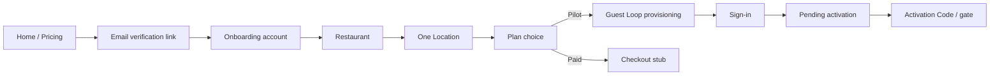

# Self-service Pilot

The public path from the **marketing homepage** or **Pricing** through **Email verification**, **Guest Loop onboarding**, **Guest Loop provisioning**, **Sign-in**, and **Pending activation** / **Activation Code**. Distinct from demo/sales **Trial Request** (see [admin.md](./admin.md)) and from **Team invitation** accept (see [team.md](./team.md)).

UI may say Get started, Create an account, Set up your account, or Start 30-day Pilot — those strings are not domain headings.

## Status summary

| Feature | Status |
|---------|--------|
| Marketing entry (Home / Pricing → Get started / Start 30-day Pilot) | Planned |
| Email verification (link) | Planned |
| Social start (Google + Microsoft) | Planned |
| Guest Loop onboarding — account / restaurant / location / plan | Planned |
| Plan choice — Pilot happy path | Planned |
| Plan choice — paid Starter / Growth / Group | Planned (stub — checkout/billing out of scope) |
| Guest Loop provisioning after Pilot choice | Planned (reuse shipped provisioning behaviour) |
| Sign-in → Pending activation / Activation gate | Shipped (post-provisioning) |
| Admin Trial Request public path | Retired as public path — demo/sales only |

## Domain terms

| Term | Definition |
|------|------------|
| **Self-service Pilot** | Public path from marketing through onboarding to later Activation |
| **Email verification** | Verification **link** before Guest Loop onboarding; social may skip |
| **Guest Loop onboarding** | Account → restaurant → one Location → plan choice |
| **Guest Loop provisioning** | Default QR codes + Activation Code after Pilot plan choice |
| **Pilot** | £0 Subscription plan chosen at plan choice (distinct from the path name) |

Shared Auth chrome (social buttons, Terms, password **Good** minimum): see [sign-in.md](./sign-in.md#auth-chrome-shared).

---

## Happy path (locked)

| Step | What happens |
|------|----------------|
| 1 | Visitor starts from Home (**Get started** / work email or Google / Microsoft) or Pricing (**Start 30-day Pilot**) |
| 2 | **Email verification** via link (skipped when social start succeeds) |
| 3 | **Guest Loop onboarding** — account credentials |
| 4 | Restaurant details |
| 5 | **One** Location (v1 happy path) |
| 6 | Plan choice — user may pick Pilot **or** a paid plan; product docs detail **Pilot** only; paid = stub |
| 7 | **Guest Loop provisioning** (default QR codes + Activation Code generation) |
| 8 | **Sign-in** |
| 9 | **Pending activation** until **Activation Code** / **Activation gate** succeeds |

Activation fulfilment and the Activation gate remain after self-service onboarding — see [activation-and-fulfilment.md](./activation-and-fulfilment.md).

---

## Entry (marketing)

| | |
|---|---|
| **Status** | Planned |
| **Launch blocker** | Soft until FE/BE build map |
| **Compliance** | Terms acceptance on account create; links to Terms and Privacy |

### User flow

1. Visitor opens `/` (Home) or Pricing.
2. Enters work email and continues, or uses **Continue with Google** / **Continue with Microsoft**.
3. Link-based **Email verification** (unless social skipped it).
4. Continues into Guest Loop onboarding.

Demo/sales **Get a demo** / Contact us may remain sales-led and is not this path.

### Distinct path

Joining an existing restaurant uses **Team invitation** accept — not Self-service Pilot. See [team.md](./team.md).

---

## Email verification

| | |
|---|---|
| **Status** | Planned |
| **Launch blocker** | Soft |

### Behaviour

- Screen title: Verify your email.
- Message: verification **link** sent to the work email.
- Actions: Resend verification email; Use a different email.
- No OTP fields on this step.
- Distinct from **Sign-in OTP** and from demo/sales Trial Request OTP.

### Screens

| Screen | Notes |
|--------|-------|
| Verify your email | Figma Marketing Website `4685:16998` |

---

## Guest Loop onboarding

| | |
|---|---|
| **Status** | Planned |
| **Launch blocker** | Soft |

### Steps

| Step | UI label (approx.) | Content |
|------|--------------------|---------|
| Account | Set up your account | Work email (prefilled); full name (UI may show First name + Last name); **Account password** + confirm; **Password strength** **Good** minimum; Continue |
| Restaurant | Tell us about your restaurant | Restaurant name; restaurant type; website optional; Back / Continue |
| Location | Set up your first Location | Location name; Address; City/town; Postcode; Country (default UK); Timezone (default Europe/London); Back / Continue |
| Plan choice | Choose how you'd like to start | Monthly / Annual; **Start 30-day Pilot**; Choose Starter / Growth / Group (paid stub) |

Wizard chrome may show “3 of 3” on Location while plan choice still follows — treat plan as the end of Guest Loop onboarding.

### Edge cases

| Case | Behaviour |
|------|-----------|
| Password below Good | Client blocks continue (Figma “≥8 chars” is an incomplete hint, not the rule) |
| Paid plan chosen | Documented as stub; checkout/billing later pack |
| More than one Location | Out of v1 happy-path docs |

### Screens (Figma)

| Step | Marketing Website node |
|------|------------------------|
| Account | `4433:5401` |
| Restaurant | `4692:19675` |
| Location | `4685:17516` |
| Plan choice | `4692:24377` |

---

## Guest Loop provisioning (after Pilot)

| | |
|---|---|
| **Status** | Planned on this path (behaviour Shipped on demo/sales Operator Setup) |

After Pilot plan choice, run the same preparation as today: three default **QR code**s per Location, then Activation Code generation. Then redirect to Sign-in. No JWT at end of provisioning — operator must Sign-in.

Details: [operator-setup.md](./operator-setup.md#smart-guest-link--default-qr-creation) (provisioning behaviour); gate: [activation-and-fulfilment.md](./activation-and-fulfilment.md).

---

## Flow diagram

## Not yet live

| Item | Status | Notes |
|------|--------|-------|
| Full Self-service Pilot FE/BE | Planned | Later build map |
| Paid plan checkout after plan choice | Planned | Stub only in this pack |
| Custom analytics for Self-service events | Planned | See [analytics.md](./analytics.md) |

## Implementation notes

- Replaces public **Trial Request** / `HeroTrialForm` / `/#request-trial` as the main path.
- Demo/sales Trial Request + **Trial request review** remain documented under [admin.md](./admin.md) until map fog on retire/archive settles.
- Former file: `trial-request.md` (renamed).
