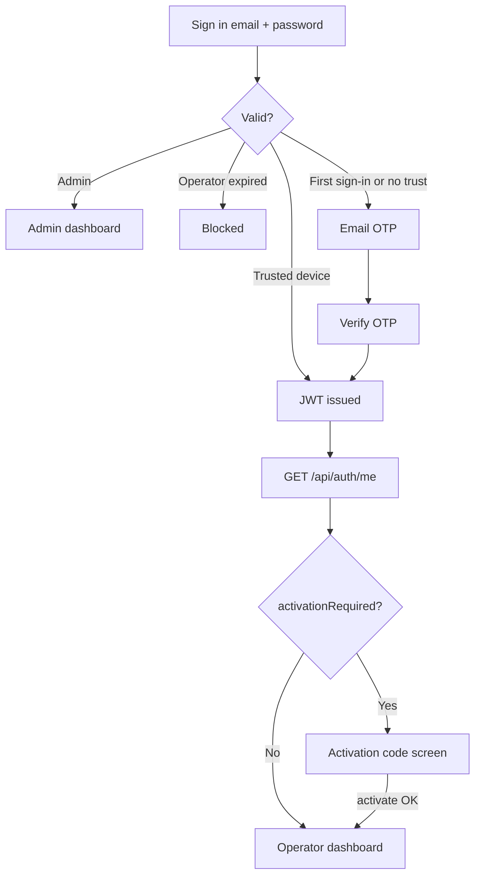

# Sign-in

Authentication for returning **operators** and **admins**, including password reset and **Sign-in OTP**. Operators in **Pending activation** complete Sign-in but are held at the **Activation Code screen** until **Account activation** succeeds.

## Status summary

| Feature | Status |
|---------|--------|
| Password Sign-in | Shipped |
| Universal login (admin/operator) | Shipped |
| Sign-in OTP (email) | Shipped |
| Sign-in OTP (SMS) | Partial — Twilio wired; requires phone on file |
| Trusted device (30 days) | Shipped |
| First Sign-in always OTP | Shipped |
| Forgot / reset password | Shipped |
| Workspace selection (A5) | Partial — UI + backend flag exist; **dormant** (one restaurant per operator today); workspace APIs not implemented |
| Activation Code screen | Shipped |
| New device notification email | Shipped |

## Domain terms

| Term | Definition |
|------|------------|
| **Sign-in** | Password (+ OTP when required) → JWT session |
| **Sign-in OTP** | Six-digit code; email default; SMS alternate |
| **Trusted device** | Browser remembered 30 days after OTP; may skip OTP |
| **First Sign-in** | First successful Sign-in after Operator Setup — always requires OTP |
| **Verified phone** | Non-empty `PhoneNumber` on operator account — enables SMS Sign-in OTP (no separate verification flag) |
| **Pending activation** | Setup complete but Activation Code not yet entered — APIs gated |
| **Activation expired** | 30-day **Activation period** ended — Sign-in blocked |
| **Workspace selection** | Post-auth restaurant picker for multi-restaurant operators — dormant |

---

## Sign-in (credentials)

| | |
|---|---|
| **Status** | Shipped |
| **Launch blocker** | None |

### User flow

1. User opens `/login`.
2. Enters email + password → `POST /api/auth/universal-login`.
3. **Admin** → JWT immediately → `/admin-dashboard`.
4. **Operator** → password validated:
   - **Activation expired** → error; no session
   - **First Sign-in** or no valid trust → email OTP sent → OTP step
   - Valid **Trusted device** → JWT + routing fields → dashboard or activation screen

### States

| State | Client | Server |
|-------|--------|--------|
| Credentials | `SignInForm` | — |
| OTP entry | `SignInVerifyOtpStep` | `OtpVerifications` |
| Choose channel | `SignInChooseMethodStep` | — |
| Activation | `SignInActivationCodeStep` | `Users.ActivatedAt` null |
| Workspace | `SignInChooseWorkspaceStep` | `workspaceSetupRequired` when operator owns **≥2 restaurants** (dormant today) |

### Backend actions

| Endpoint | Purpose |
|----------|---------|
| `POST /api/auth/universal-login` | Password check; OTP send or JWT |
| `POST /api/auth/login` | Operator-only variant |
| `POST /api/auth/verify-otp` | Validate OTP; issue JWT; optional trusted device |
| `POST /api/auth/send-otp` | Resend email OTP |
| `POST /api/auth/send-otp-sms` | Send SMS OTP |
| `GET /api/auth/me` | Routing: `activationRequired`, `accountType`, workspace flags — **operator JWT only** (admin JWT returns user-not-found) |

### Edge cases

| Case | Behaviour |
|------|-----------|
| Wrong password | Generic error; **5 failed attempts** → `IsLocked = true` (operators via `ValidateUserCredentialsAsync`) |
| Locked account | Sign-in rejected with `"Account is locked."` (operators). **Admin on `universal-login`:** lock counter not applied — use `admin-login` for lock enforcement |
| OTP expired (10 min) | Verify fails |
| Resend OTP | Invalidates previous; sends on active channel |
| Uncheck Remember device | Does not revoke existing trust |
| Sign out | Clears JWT; keeps `deviceToken` in localStorage |
| `/me` fails with valid token | Client falls back to stored `accountType` for dashboard route |

### Screens

| Screen | Route | Fields | Permissions | Analytics |
|--------|-------|--------|-------------|-----------|
| Sign-in | `/login` | email, password, remember device | Public | `page_view` |
| OTP | `/login` | 6-digit OTP | Public | `page_view` |
| Choose method | `/login` | channel buttons | Public | `page_view` |
| Activation code | `/login` | activation code | JWT | `page_view`; `account_activated` (Planned) |

### Emails

| Email | Trigger | Subject | Status |
|-------|---------|---------|--------|
| Sign-in OTP | After password gate | Your Tummly verification code | Shipped |
| New sign-in | OTP verified (notification) | New sign-in to your Tummly account | Shipped |

### Entry points

`LoginPage.tsx` → `SignInForm.tsx`, `sessionRouting.ts` → `AuthController` → `AuthService`

---

## Trusted device

| | |
|---|---|
| **Status** | Shipped |
| **Launch blocker** | None |

### Behaviour

- Checkbox on Sign-in (defaults checked)
- On OTP verify with Remember: opaque `deviceToken` in localStorage + `TrustedDevices` row (30-day expiry)
- Sent on subsequent `universal-login` → may skip OTP
- **First Sign-in** always requires OTP regardless of checkbox

---

## SMS Sign-in OTP

| | |
|---|---|
| **Status** | Partial |
| **Launch blocker** | None |

### User flow

From choose-method step → `POST /api/auth/send-otp-sms` when **Verified phone** exists.

### Edge cases

- SMS button hidden when no phone on file
- Twilio Verify used server-side

---

## Forgot password

| | |
|---|---|
| **Status** | Shipped |
| **Launch blocker** | None |

### User flow

1. `/forgot-password` → enter email → `POST /api/auth/forgot-password`.
2. Email sent with reset link → `/reset-password?token=`.
3. New password (Good strength minimum) → `POST /api/auth/reset-password`.
4. Success screen → return to Sign-in.

### Emails

| Email | Subject | Status |
|-------|---------|--------|
| Password reset | Reset your Tummly password | Shipped |
| Password changed | Your Tummly password was changed | Shipped |

### Entry points

`ForgotPasswordPage.tsx`, `ResetPasswordPage.tsx` → `forgotPasswordFlow.ts`, `resetPasswordFlow.ts`

---

## Post-login routing

| Condition | Destination |
|-----------|-------------|
| Admin | `/admin-dashboard` |
| `activationRequired` | Activation Code screen (same `/login` flow) |
| `workspaceSetupRequired` | Workspace step when operator owns ≥2 restaurants — **dormant** (one restaurant per operator); `GET/POST /api/auth/workspaces` not implemented |
| `accountType` Single | `/single-dashboard` |
| `accountType` Multi | `/multi-dashboard` (optional `?location=` when `selectedLocationId` set — dormant) |

### Activation gate (client)

Axios 403 `activationRequired` → stay on activation step.  
403 `activationExpired` → clear session.

---

## Flow diagram

## Not yet live

| Item | Status |
|------|--------|
| Workspace selection at Sign-in | Partial — backend sends flag when 2+ restaurants; frontend UI exists; **workspace list/select APIs missing** |
| Custom analytics events | Planned |
| In-login password reset | Removed — standalone `/reset-password` only |
| Admin account lock on `universal-login` | Gap — lock only enforced on dedicated `admin-login` |

## Implementation notes

- Legacy screen inventory: [sign_in_flows.md](../sign_in_flows.md) (superseded for product truth)
