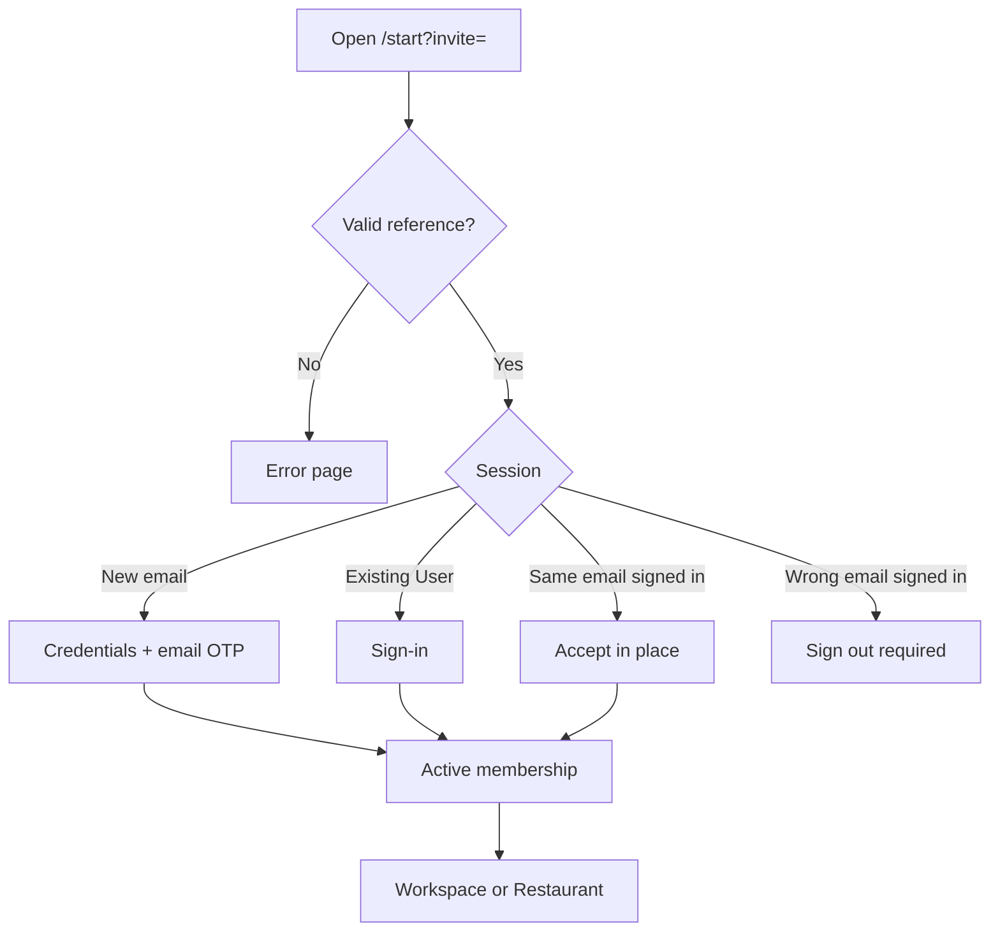

# Team invitation

Restaurant-scoped pending invite for one email to join one Restaurant as a **Team member**. Distinct from **Self-service Pilot** and from demo/sales **Operator Setup invitation**.

This document owns the **full accept path**. Marketing Figma Create an account (`4547:10144`) is the visual for **new User** credentials chrome only. Send / Resend / Revoke stay thin here; who may invite is Team & permissions locks.

UI may say Create an account — that string is not a domain heading.

## Status summary

| Feature | Status |
|---------|--------|
| Send Team invitation (Operator UI) | Planned |
| Accept — new User credentials | Planned |
| Accept — existing User Sign-in | Planned |
| Accept in place (already signed in) | Planned |
| Resend / Revoke | Planned |
| Invitation email | Planned |
| Access activity on send / Resend / Revoke / Accept | Planned |

## Domain terms

| Term | Definition |
|------|------------|
| **Team invitation** | Pending email invite; not a membership until accept |
| **Opaque invitation reference** | Unguessable secret in `/start?invite=` — one-time; rotated on Resend |
| **Restaurant membership** | Created on accept with role + Location scope frozen at send |
| **Full name** | Required on send; stored as one name. UI may show First name + Last name |

Shared Auth chrome (Google + Microsoft, Terms, password **Good**): see [sign-in.md](./sign-in.md#auth-chrome-shared). Do not re-list those rules here.

**Distinct from Self-service Pilot:** short note only on marketing / Pilot docs; this file owns accept detail.

---

## Object and states

One pending **Team invitation** per email per Restaurant. Row holds: email, full name, **permission role**, **Location scope**, optional message, inviter, sent time, expiry, **opaque invitation reference**.

You cannot invite a person as **Owner**. Send does not create a membership.

| State | Token | Pending invitations tab | Membership |
|-------|-------|-------------------------|------------|
| Pending (not expired) | Live | Shown | None |
| Pending expired | Dead | Shown until Resend or Revoke | None |
| Accepted | Consumed | Removed (person on Members) | **Active** |
| Revoked | Dead | Removed | None |

**Lifetime:** 7 days from send and from each Resend (Operator Setup stays 14 days). No auto-reminder job.

**Resend:** pending or expired. Rotates opaque reference; old `/start` URL dies; new 7-day window; same email/name/role/scope/message.

**Revoke:** pending or expired. Kills reference; drops row; no email. Re-invite of that email allowed.

---

## Accept path

| | |
|---|---|
| **Status** | Planned |
| **Launch blocker** | Soft until Team & permissions build |

### Canonical URL

`/start?invite={{opaque_invitation_reference}}`

- Query name is `invite`, not `token`.
- `/start` is only this path. Missing / empty / malformed `invite` → same error as unknown reference.
- Do **not** use `/setup-account-*` or run Operator Setup / Guest Loop onboarding.
- Stay on `/start` for credentials, Sign-in, and email OTP until membership exists.

### Session behaviour

| Session | Behaviour |
|---------|-----------|
| Unknown, expired, revoked, or already-accepted reference | Error page. No credentials form. |
| Logged out, new email | Credentials only (**Account password** **Good** or better). Prefill name from invitation; person may edit. No phone. Then **First Sign-in** with **email OTP** (not Self-service Pilot verification link). Create User + membership. |
| Logged out, existing User | Sign-in with invited email, then membership only. Do not change password or name. |
| Logged in, invited email | Accept in place. Membership only. |
| Logged in, different email | Stop. Show invited email. Person must Sign out, then continue. |

After membership: **Workspace selection** if more than one **Active** membership; else that Restaurant.

### New User chrome (Marketing Figma)

| Field | Notes |
|-------|-------|
| Invite copy | You’ve been invited to join {Restaurant} on Tummly |
| Email | Pre-shown from invitation |
| Full name | UI may be First name + Last name |
| Password | **Password strength** **Good** minimum (Figma ≥8 is incomplete hint) |
| Terms / Privacy | Required checkbox |
| Create account | Primary |
| Continue with Google / Microsoft | Shared Auth chrome |
| Sign in | Link for existing User path |

### Activation gate

Team invitees never receive an **Activation Code** and never see the Activation Code screen for this join. A new User from Team invitation is not **Pending activation**.

Access to **this** Restaurant follows this Restaurant’s **Account owner** (Pending / Expired hold with wait message — not the Activation Code screen).

### Duplicate email (deny)

| Email state | Rule |
|-------------|------|
| Active membership in this Restaurant | Deny |
| Deactivated membership in this Restaurant | Deny — Reactivate, do not invite |
| Pending Team invitation to this Restaurant | Deny — Resend or Revoke |
| Account owner of this Restaurant | Deny |
| Tummly staff Admin / Support on that email | Deny |
| Trial Request not `AccountCreated` | Deny |
| Active membership in a different Restaurant | Allow |
| No membership (including after Remove) | Allow |

---

## Send / Resend / Revoke (thin)

| Action | Notes |
|--------|-------|
| Send | Operator Invite team member modal (Guest Loop MVP Figma — not Marketing Create account). Role + Location scope frozen. |
| Resend | Same payload; rotate reference |
| Revoke | No email; row dropped |

Who may send / Resend / Revoke: Team & permissions who-may-invite lock.

---

## Email

| | |
|---|---|
| **Status** | Planned |

Transactional operator email (`BaseEmailTemplate`, Transactional footer). Subject: `You've been invited to {{workspace_name}} on Tummly`. **Accept invitation** → `/start?invite=` with current opaque reference. Empty optional message block omitted.

---

## Access activity

Send, Resend, Revoke, and Accept emit **Access activity** (Security tab catalog elsewhere).

---

## Flow diagram

## Not yet live

| Item | Status |
|------|--------|
| Full Team & permissions FE/BE | Planned |
| Marketing Create account route wired to `/start` | Planned |

## Implementation notes

- Product locks: `.scratch/team-and-permissions/issues/05-invitation-lifecycle-and-accept-path.md`
- Self-service Pilot docs: [self-service-pilot.md](./self-service-pilot.md)
- Glossary: `CONTEXT.md` **Team invitation**, **Opaque invitation reference**
