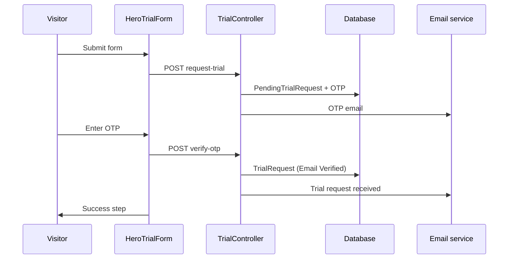

# Trial Request

A prospective operator's application to start a guided trial from the **marketing homepage**. Requires email verification (OTP) before the application awaits **trial request review** by an admin.

## Status summary

| Feature | Status |
|---------|--------|
| Trial Request form | Shipped |
| Email OTP verification | Shipped |
| Trial request received email | Shipped |
| Main location (UK address) | Shipped |
| Resend OTP | Shipped |
| Admin review handoff | Shipped (see [admin.md](./admin.md)) |

## Domain terms

| Term | Definition |
|------|------------|
| **Trial Request** | Verified application stored in `TrialRequests` after OTP success |
| **Pending Trial Request** | Pre-verification draft in `PendingTrialRequests` while OTP is outstanding |
| **Main location** | Primary venue address on the trial form — distinct from **Address** captured later in Operator Setup |
| **Trial request received email** | Acknowledgement sent immediately after email verification — not the OTP email |

---

## Trial Request form

| | |
|---|---|
| **Status** | Shipped |
| **Launch blocker** | None |
| **Compliance** | Terms acceptance required; links to Terms and Privacy |

### User flow

1. Visitor opens marketing homepage (`/`) or navigates to `/#request-trial`.
2. Completes **HeroTrialForm** and submits.
3. Frontend calls `POST /api/Trial/request-trial`.
4. UI advances to OTP step (`HeroTrialOtpStep`).
5. User enters OTP → `POST /api/Trial/verify-otp`.
6. On success → `HeroTrialSuccessStep` (expectations for review timing).

### States

| State | Where stored | Meaning |
|-------|--------------|---------|
| Form in progress | Client only | Before first submit |
| Pending OTP | `PendingTrialRequests` | OTP sent, not yet verified |
| Email verified | `TrialRequests` | `Status = "Email Verified"` (stored string; UI normalizes to `EMAIL_VERIFIED`), awaits admin |
| (downstream) | — | See [admin.md](./admin.md) for review states |

### Backend actions

| Step | Endpoint | Service | Tables |
|------|----------|---------|--------|
| Submit | `POST /api/Trial/request-trial` | `TrialService.CreateTrialRequestAsync` | Upsert `PendingTrialRequests`; create `OtpVerifications`; send OTP email |
| Verify | `POST /api/Trial/verify-otp` | `TrialService.VerifyOtpAsync` | Promote to `TrialRequests`; delete pending row; mark OTP used |
| Resend | `POST /api/Trial/resend-otp` | `TrialService.ResendOtpAsync` | New OTP; 60s cooldown; max **5 resends** then abandoned |

**Account type inference:** `Locations == "1"` → `AccountType = Single`; otherwise `Multi`.

### Edge cases

| Case | Behaviour |
|------|-----------|
| Email already registered as `User` | Submit rejected: "Email already in use." |
| Trial already verified for email | Submit rejected: "Trial request already verified." |
| Invalid or expired OTP | Verify returns false; UI shows error |
| OTP already used | Verify fails |
| Resend within 60s | Error: `"Please wait before resending OTP."` |
| 5+ OTP resends | Pending request marked `IsAbandoned`; error: `"OTP resend limit reached."` |
| No pending request on resend | Error: "No pending request found." |
| Received email fails to send | Verification still succeeds; error logged server-side |

### Screens

| Screen | Route | Key fields | Permissions | Data written | Analytics |
|--------|-------|------------|-------------|--------------|-----------|
| Trial form | `/` `#request-trial` | businessName, businessCategory, locations, businessLink, mainLocation, townCity, postcode, fullName, email, mobile, role, goal, termsAccepted | Public | `PendingTrialRequests` on submit | `page_view` only (Shipped); `trial_request_started` (Planned) |
| OTP step | Same (in-hero step) | otpCode | Public | `TrialRequests` on verify | `page_view`; `trial_otp_verified` (Planned) |
| Success step | Same | — | Public | — | `page_view` |

**Main location UX:** User must commit to an address lookup suggestion or **Use my address instead** before town/city and postcode are required (`mainLocationCommitted`).

### Emails

| Email | Trigger | Subject | Status |
|-------|---------|---------|--------|
| Trial OTP | `request-trial` / `resend-otp` | Your Tummly verification code | Shipped |
| Trial request received | Successful `verify-otp` | We've received your Tummly trial request | Shipped |

### Entry points

| Layer | Module |
|-------|--------|
| Frontend | `HeroTrialForm.tsx` → `trialApi.ts` |
| Backend | `TrialController` → `TrialService` |
| Database | `PendingTrialRequests`, `TrialRequests`, `OtpVerifications` |

---

## Address lookup (Trial Request)

| | |
|---|---|
| **Status** | Shipped |
| **Launch blocker** | None |
| **Compliance** | UK address data via Ideal Postcodes (processor) |

### User flow

Operator types **Main location** → autocomplete suggestions → select or manual entry → town/city and postcode auto-filled or entered manually.

### Backend actions

| Endpoint | Purpose |
|----------|---------|
| `GET /api/address/suggest` | Autocomplete |
| `GET /api/address/resolve-suggestion` | Full address from suggestion |
| `GET /api/address/resolve` | Postcode reconciliation |

Cached on backend (suggestions ~1h; postcode ~24h). Rate-limited.

### Entry points

`TrialMainLocationFields.tsx` → `addressLookupApi.ts` → `AddressController` → `AddressLookupService`

---

## Flow diagram

## Not yet live

| Item | Status | Notes |
|------|--------|-------|
| Custom analytics events | Planned | See [analytics.md](./analytics.md) (Batch 2) |
| Operator self-service trial status page | Planned | No public status URL today |
| Confirmation SMS for trial | Planned | Email OTP only |

## Implementation notes

- Legacy audit: [guest-loop-audit.md](../guest-loop-audit.md) (trial OTP on homepage marked in scope there)
