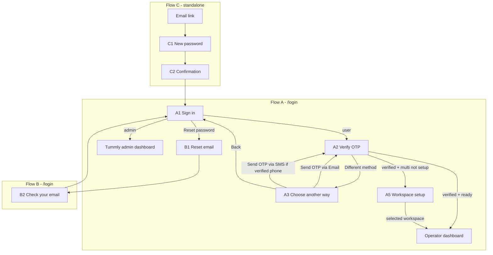

# Sign-in flows — screen inventory

**Status:** Planning (UI + API work not started)  
**Last updated:** 2026-06-15  
**Related:** [form_function.md](./form_function.md) (form stack), [CONTEXT.md](../CONTEXT.md) (domain terms)

This document is the canonical screen inventory for Sign-in, Reset your password, and Create new password. Use it for Figma parity work and implementation tracking.

**Legend:** ✅ Done · 🟡 Partial · ❌ Missing · 🗑️ Remove · 🔧 Backend needed

---

## Locked product decisions

| # | Decision | Implication |
|---|----------|-------------|
| 1 | **Small Figma workspace setup screen** in the sign-in flow | New step after OTP when multi user + workspace not setup; **not** full `RegisterMultiPage` |
| 2 | **“Choose another way to sign-in”** is its own screen | OTP screen link navigates here, not back to credentials |
| 3 | **Send OTP via SMS** only when user has a **verified phone** | Hide SMS button when no verified phone |
| 4 | **Remember this device** stays | Checkbox on sign-in screen; wire backend when available |
| 5 | **Reset password is standalone only** | Canonical path: `/reset-password?token=`; remove in-login reset steps |

**Dashboard naming:** After workspace setup (A5), the user lands on the **operator dashboard scoped to the selected workspace** (likely `/multi-dashboard` with workspace context). This is distinct from `/admin-dashboard`, which is reserved for Tummly internal admins (`RoleRoute role="ADMIN"`). Confirm exact route/query params against Figma before implementation.

**Account Setup (separate flow):** Post-approval invite setup lives at `/setup-account`, `/setup-account-single`, and `/setup-account-multi` (`RegisterSinglePage` / `RegisterMultiPage`). Do not merge with sign-in workspace setup (A5).

---

## Master screen list

### Flow A — Sign-in (`/login` wizard)

| ID | Figma screen | Step key (proposed) | Status | Priority |
|----|--------------|---------------------|--------|----------|
| A1 | Sign in — Email / Password | `SIGN_IN` | 🟡 UI + copy | P1 |
| A2 | Verify it's you (OTP) | `VERIFY_OTP` | 🟡 UI + API fixes | P1 |
| A3 | Choose another way to sign-in | `CHOOSE_SIGN_IN_METHOD` | ❌ New screen | P2 |
| A4 | Verify it's you (email or SMS channel) | `VERIFY_OTP` (reuse, channel state) | 🟡 Extend A2 | P2 |
| A5 | Set up your workspace (first sign-in, multi, not setup) | `WORKSPACE_SETUP` | ❌ New screen | P3 |

### Flow B — Reset your password (`/login` only)

| ID | Figma screen | Step key (proposed) | Status | Priority |
|----|--------------|---------------------|--------|----------|
| B1 | Reset your password — Email | `RESET_EMAIL` | 🟡 UI + shell | P1 |
| B2 | Check your email | `RESET_EMAIL_SENT` | ❌ Split from inline success | P1 |

### Flow C — Create new password (standalone)

| ID | Figma screen | Route | Status | Priority |
|----|--------------|-------|--------|----------|
| C1 | Create new password | `/reset-password?token=` | 🟡 Figma shell | P1 |
| C2 | Password reset confirmation | `/reset-password` (success state) | 🟡 Unify UX | P1 |

### Remove from codebase

| Item | Reason |
|------|--------|
| `STEPS.FORGOT_EMAIL` | Dead path; not in Figma |
| `STEPS.RESET_PASSWORD` + `STEPS.PASSWORD_SUCCESS` on `LoginPage` | Standalone only (decision 5) |
| `/login?token=` handling | Redirect → `/reset-password?token=` |
| Google sign-in block + “or” divider | Not in Figma |
| Duplicate reset UI in `LoginPage` | Single surface: `ResetPasswordPage` |

---

## Flow A — Sign-in (detailed)

### A1 — Sign in (Email / Password)

| Check | Target | Code today | Action |
|-------|--------|------------|--------|
| Route | `/login` | ✅ `STEPS.LOGIN` | — |
| Email + password | Yes | ✅ RHF + `signInCredentialsSchema` | Figma visual pass |
| Remember this device checkbox | Yes | 🟡 UI + schema; not persisted | Keep UI; 🔧 backend |
| Submit | `POST /auth/universal-login` | ✅ | — |
| Admin → skip OTP | Yes | ✅ → `/admin-dashboard` | — |
| User → OTP → A2 | Yes | ✅ | — |
| Reset password → B1 | Yes | ✅ | — |
| No Google | Yes | 🗑️ Remove block | P1 |
| Copy: “Sign in” not “Login” | Yes | 🟡 | P1 |
| Shared Figma auth shell | Yes | ✅ `AuthShell` | P1 |

**Entry points:** Navbar, Footer, CTA, Trial form “Sign in”, `ProtectedRoute`, `RoleRoute`, axios 401 → `/login`.

---

### A2 — Verify it's you (OTP)

| Check | Target | Code today | Action |
|-------|--------|------------|--------|
| Default after A1 (email OTP) | Yes | ✅ `FORGOT_OTP` | Rename → `VERIFY_OTP` |
| Masked destination copy | Email or phone by channel | 🟡 Email only | Channel-aware copy |
| 6-digit input, verify, resend | Yes | ✅ | — |
| “Use a different sign-in method” → A3 | Yes | 🟡 Calls `handleBackToLogin` | Fix navigation |
| Verify API | `POST /auth/verify-otp` | 🟡 Response shape mismatch | Parse `data.Token`, `data.AccountType` |
| Post-verify routing | See below | 🟡 Always `/multi-dashboard` | Fix routing |

**Post-verify routing (target):**

```
OTP verified
  ├─ ADMIN                              → /admin-dashboard
  ├─ USER + workspace not setup + Multi → A5 Workspace setup
  └─ USER + workspace ready
        ├─ Single                       → /single-dashboard
        └─ Multi                        → /multi-dashboard (selected workspace)
```

---

### A3 — Choose another way to sign-in (new)

| Check | Target | Code today | Action |
|-------|--------|------------|--------|
| Screen exists | Yes | ❌ | Build |
| Entry from A2 | Yes | ❌ | Replace back-to-login on OTP link |
| **Send OTP via Email** | Yes, first option | ❌ | Trigger/resend email OTP → A2 |
| **Send OTP via SMS** | Yes, below email | ❌ | 🔧 + UI; hidden if no verified phone |
| Back to sign in (credentials) | Likely | ❌ | → A1 |

**State:** `email`, `hasVerifiedPhone`, `maskedPhone`, `otpChannel` (`email` | `sms`).

---

### A4 — OTP entry (channel variant)

Reuse A2 component; differentiate by copy and API:

| Channel | Copy | API |
|---------|------|-----|
| Email | “We sent a 6-digit code to j••••@domain.com” | 🔧 `POST /auth/send-otp` (email) |
| SMS | “We sent a 6-digit code to ••••1234” | 🔧 `POST /auth/send-otp-sms` |

---

### A5 — Set up your workspace (new, sign-in only)

| Check | Target | Code today | Action |
|-------|--------|------------|--------|
| Trigger | Multi user + workspace not setup after OTP | ❌ | 🔧 flag from verify-otp |
| Scope | Small Figma screen only | ❌ | New step + schema subset |
| Workspace selection | User picks workspace | ❌ | 🔧 list workspaces API |
| Submit → dashboard | Operator dashboard for selected workspace | ❌ | Route + context |
| Distinct from invite setup | `/setup-account-multi` | ✅ | Keep separate |

**Open spec:** Confirm exact fields on this screen from Figma (workspace name, location picker, etc.).

---

## Flow B — Reset your password (`/login`)

### B1 — Reset your password (email)

| Check | Target | Code today | Action |
|-------|--------|------------|--------|
| Entry from A1 | Yes | ✅ `RESET_EMAIL` | Figma shell |
| Email + “Send reset link” | Yes | ✅ `POST /auth/forgot-password` | — |
| Email link target | `/reset-password?token=` | ✅ Backend | — |
| On success → B2 | Dedicated step | 🟡 Inline success on B1 | Split step |

### B2 — Check your email (new step)

| Check | Target | Code today | Action |
|-------|--------|------------|--------|
| Dedicated screen | Yes | ❌ | Add `RESET_EMAIL_SENT` |
| Back to sign in | Yes | 🟡 On same card today | Move to B2 |

---

## Flow C — Create new password (standalone only)

| Check | Target | Code today | Action |
|-------|--------|------------|--------|
| Canonical URL | `/reset-password?token=` | ✅ `ResetPasswordPage` | Figma shell |
| `/login?token=` | Redirect to C1 | 🟡 Opens login wizard | Redirect |
| Password + confirm | Yes | ✅ `resetPasswordFormSchema` | — |
| Success → C2 | Dedicated confirmation | 🟡 Inline + auto-redirect | Match Figma |
| CTA → `/login` | Yes | ✅ | — |
| Remove wizard duplicates | Yes | 🟡 In `LoginPage` | 🗑️ |

---

## Flow diagram



---

## API / backend checklist

| # | Requirement | Unblocks |
|---|-------------|----------|
| 1 | Fix verify-otp client parsing (`data.Token`, `data.AccountType`) | A2 routing |
| 2 | `hasVerifiedPhone` (+ optional `maskedPhone`) on login/verify response | A3 SMS visibility |
| 3 | `workspaceSetupRequired` for multi users | A5 gate |
| 4 | `POST /auth/send-otp` (email resend) | A2 resend, A3 email button |
| 5 | `POST /auth/send-otp-sms` | A3 SMS button |
| 6 | Verify OTP accepts email or SMS channel | A4 |
| 7 | Workspace list + setup completion for A5 | A5 submit |
| 8 | Remember-device persistence | A1 checkbox |
| 9 | Redirect `/login?token=` → `/reset-password?token=` | C1 |

---

## Implementation phases

| Phase | Scope |
|-------|--------|
| **1 — Shell + cleanup** | Shared auth layout; remove Google; remove login reset steps; `/login?token` redirect; B2 split; C1/C2 Figma on `ResetPasswordPage` |
| **2 — Sign-in core** | A1 Figma pass; A2 fixes (API + routing); B1 Figma pass |
| **3 — Alternate sign-in** | A3 screen; conditional SMS; channel-aware A2 |
| **4 — First sign-in workspace** | A5 screen + backend (after Figma field spec) |
| **5 — Auth state (post-flow)** | Migrate session to Zustand + `persist` (see below) |

---

## Post sign-in flow — auth state migration

**When:** After Flows A–C are complete (shell, OTP, alternate sign-in, workspace setup, standalone reset). Do not block current sign-in UI work on this.

**Why:** Auth is read/written in several places today (`authHelpers.ts`, `ProtectedRoute`, `RoleRoute`, `axiosInstance`). As sign-in grows (logout UX, `accountType`, workspace context, remember device, verified phone), a single store avoids scattered `localStorage` calls and keeps route guards, axios, and UI in sync.

**Approach:** Zustand with the `persist` middleware — Zustand as the in-app API, `localStorage` as the backing store (not a replacement for persistence).

| Item | Detail |
|------|--------|
| Store | `useAuthStore` (e.g. persist key `tummly-auth`) |
| Initial shape | `token`, `role` (`ADMIN` \| `USER`) |
| Extend later | `accountType`, selected workspace, `hasVerifiedPhone`, remember-device flag |
| Replace | Direct `localStorage.getItem/setItem/removeItem` in guards and axios |
| Keep | `persistAuthSession` / clear-session logic — move into store actions (`login`, `logout`, `clearSession`) |
| Consumers | `ProtectedRoute`, `RoleRoute`, `axiosInstance`, login/OTP handlers, future Navbar logout |

**Dependency:** `zustand` is already installed; add `persist` from `zustand/middleware` when implementing.

---

## Code map (current)

| Screen | File | Notes |
|--------|------|-------|
| Sign-in wizard (all steps today) | `src/pages/auth/LoginPage.tsx` | Monolith; refactor as steps are added |
| Standalone reset | `src/pages/auth/ResetPasswordPage.tsx` | Becomes sole reset surface |
| Schemas | `src/schemas/signIn.ts`, `src/schemas/resetPassword.ts` | |
| OTP helpers | `src/components/home/hero-trial-otp.ts` | Reuse for sign-in OTP UX |
| Auth session (interim) | `src/pages/utils/authHelpers.ts` | `localStorage`; migrate to `useAuthStore` in phase 5 |
| Routes | `src/pages/routes/AppRoutes.tsx` | |

---

## Conversation timeline

| Date | Milestone |
|------|-----------|
| 2026-06-14 | Initial screen inventory vs Figma (chat) |
| 2026-06-14 | Product decisions 1–5 locked; checklist finalized in this doc |
| 2026-06-15 | Auth session fixes (`authHelpers`); deferred Zustand + `persist` migration noted (phase 5) |
