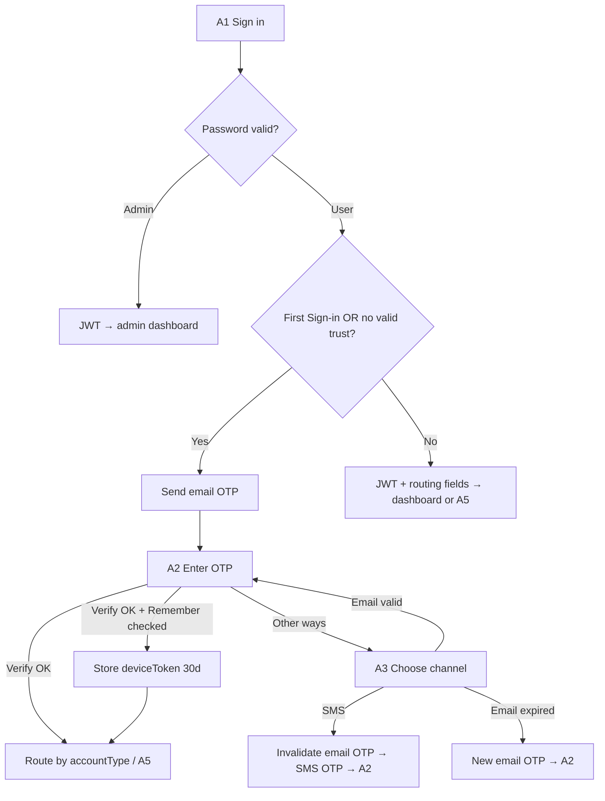
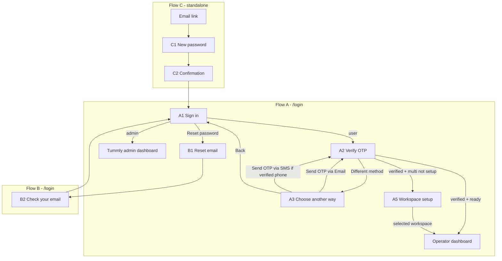

# Sign-in flows — screen inventory

**Status:** Complete — UI + logic shipped; manual QA passed (2026-06-14)  
**Last updated:** 2026-06-14  
**Related:** [form_function.md](./form_function.md) (form stack), [CONTEXT.md](../CONTEXT.md) (domain terms)

This document is the canonical screen inventory for Sign-in, Reset your password, and Create new password. Use it for Figma parity work and implementation tracking.

**Legend:** ✅ Done · 🟡 Partial · ❌ Missing · 🗑️ Remove · 🔧 Backend needed

---

## Shipped summary

| Area | Status |
|------|--------|
| Flow A (A1–A5) | ✅ UI + logic |
| Flow B (`/forgot-password`) | ✅ UI + logic |
| Flow C (`/reset-password`) | ✅ UI + logic |
| Auth shell | ✅ Hero, accent, footer |
| Trusted device + OTP channels | ✅ Email default; SMS stub |
| Zustand session (`tummly-auth`) | ✅ |
| Workspace setup (A5) | ✅ |

**Deploy note:** Migrations auto on Railway when `Database__ApplyMigrationsOnStartup=true` — wait for `Database initialized successfully` in logs. SMS OTP is stub-only until a provider is wired (see Future enhancements).

---

## Locked product decisions

| # | Decision | Implication |
|---|----------|-------------|
| 1 | **Small Figma workspace setup screen** in the sign-in flow | New step after OTP when multi user + workspace not setup; **not** full `RegisterMultiPage` |
| 2 | **“Choose another way to sign-in”** is its own screen | OTP screen link navigates here, not back to credentials |
| 3 | **Send OTP via SMS** only when user has a **verified phone** | Hide SMS button when no verified phone |
| 4 | **Remember this device** stays | Checkbox on sign-in screen; wire backend when available |
| 5 | **Reset password is standalone only** | Canonical path: `/reset-password?token=`; remove in-login reset steps |
| 6 | **First Sign-in** = first successful Sign-in after Account Setup | Always require OTP on that login, regardless of Remember checkbox |
| 7 | **Remember this device** = 30-day trusted device | Opt-in at OTP verify; valid trust auto-skips OTP on next sign-ins from same browser; checkbox **defaults to checked** on A1 |
| 8 | **Default OTP channel** = email after A1 | SMS only from A3; see channel-switch rules below |
| 9 | **Trusted device** = opaque token in `localStorage` + server row | Issued after OTP verify when Remember checked; sent on `universal-login`; 30-day expiry |
| 10 | **Unchecking Remember** does not revoke active trust | Valid trust still skips OTP (4a); uncheck = do not create/extend trust after verify |
| 11 | **Verified phone** = phone from completed Account Setup | `hasVerifiedPhone` when setup complete + `PhoneNumber` present; no separate SMS proof step |
| 12 | **Trust skip response** mirrors post-OTP verify | `{ loginType, token, accountType, workspaceSetupRequired }`; same client routing as verify-otp |
| 13 | **Sign out** clears session only | JWT removed; `deviceToken` kept — trust skip still works within 30 days |
| 14 | **A2 Resend code** | Always invalidate + send new OTP on **active channel**; cooldown/rate limits apply |

### OTP & trusted device logic (locked)



| Trigger | OTP required? |
|---------|---------------|
| First Sign-in (after Account Setup) | **Always** — ignore device token |
| Returning user, valid trusted device | **No** — JWT from `universal-login` |
| Returning user, no/expired trust | **Yes** — email OTP on A1 submit |
| Remember unchecked (4a) | Does not revoke trust; skip still applies if trust valid |
| Sign out | Session cleared; trust kept until 30-day expiry |

**Dashboard naming:** After workspace setup (A5), the operator lands on `/multi-dashboard?location={locationId}`. This is distinct from `/admin-dashboard`, which is reserved for Tummly internal admins (`RoleRoute role="ADMIN"`).

**Account Setup (separate flow):** Post-approval invite setup lives at `/setup-account`, `/setup-account-single`, and `/setup-account-multi` (`RegisterSinglePage` / `RegisterMultiPage`). Do not merge with sign-in workspace setup (A5).

---

## Future enhancements

Remaining work from implementation reviews. Not blockers for current QA; triage before production.

### Production & backend

| Item | Notes |
|------|-------|
| **Wire real SMS provider** | `SmsService` is a stub — logs `[SMS STUB]` only. Wire Twilio (or equivalent) before handset delivery. Until then: Railway logs or `OtpVerifications` table. |
| **Crypto OTP generation** | `SendOtpAsync` uses `new Random()` — switch to `RandomNumberGenerator` before production. |
| **Readiness probe + migrations** | `/health/ready` does not wait for `MigrateAsync`. Optional: fail readiness until migrations complete (~30–60s post-deploy window today). |
| **Production user backfill** | Pre-deploy users: `HasCompletedFirstSignIn = false` forces one-time OTP; `SelectedLocationId = null` forces A5 for multi. Document and run one-time SQL in [backend/DEPLOYMENT.md](../backend/DEPLOYMENT.md) when going live with existing data. |
| **Legacy OTP channel rows** | Optional SQL: `UPDATE OtpVerifications SET Channel = 'email' WHERE Channel = '' OR Channel IS NULL` |

### Auth & session

| Item | Notes |
|------|-------|
| **Logout on all dashboards** | Multi-dashboard logout clears JWT. Wire the same on single-dashboard and admin-dashboard when those shells gain nav. |
| **`selectedLocationId` in auth store** | Session (`tummly-auth`), trust (`deviceToken`), and workspace (`selectedLocationId`) are three keys — consider a Zustand slice for workspace context. |
| **Extend auth store** | Add `accountType`, `hasVerifiedPhone`, selected workspace to reduce `/auth/me` fetches. |
| **Server `selectedLocationId` on OTP verify** | Post-verify multi routing uses `localStorage` only; return `SelectedLocationId` from verify-otp / trust-skip so new browsers land on `/multi-dashboard?location=` without re-selecting. |
| **Stale session on `/me` 401** | Expired JWT may leave token in store until axios 401 — clear session when `GET /auth/me` returns unauthorized. |
| **JWT vs store role naming** | Store: `ADMIN` / `USER`; JWT claim: `Admin` / `Owner`. Guards read store — document convention; align JWT claims or avoid reading role from JWT on frontend. |

### UX & copy

| Item | Notes |
|------|-------|
| **Help Centre URLs** | `SignInForm`, `AuthFooter` use `href="#"` — replace when help centre URL is available. |
| **Verified phone copy** | `UserHasVerifiedPhone` = phone on file after Account Setup (no SMS proof). Ensure UI does not imply SMS verification was completed. |
| **Invalid reset token (C1)** | Runtime-only screen — no Figma; sufficient for QA. Optional Figma pass later. |

### Code quality

| Item | Notes |
|------|-------|
| **`LoginPage` refactor** | ~660 lines — extract step hooks or sub-pages as flows stabilize. |
| **Duplicate A5 effects** | Two `useEffect`s trigger workspace load in `LoginPage` — consolidate on next touch. |

### Auth persistence reference

| Key | Storage | Cleared on sign out? |
|-----|---------|----------------------|
| `tummly-auth` | Zustand persist (`token`, `role`) | Yes |
| `deviceToken` | `localStorage` | No (decision #13 — trust kept 30 days) |
| `selectedLocationId` | `localStorage` | No (may stale until moved to store) |

---

## Master screen list

### Flow A — Sign-in (`/login` wizard)

| ID | Figma screen | Step key (proposed) | Status | Priority |
|----|--------------|---------------------|--------|----------|
| A1 | Sign in — Email / Password | `SIGN_IN` | ✅ | P1 |
| A2 | Verify it's you (OTP) | `VERIFY_OTP` | ✅ | P1 |
| A3 | Choose another way to sign-in | `CHOOSE_SIGN_IN_METHOD` | ✅ | P2 |
| A4 | Verify it's you (email or SMS channel) | `VERIFY_OTP` (reuse, channel state) | ✅ | P2 |
| A5 | Set up your workspace (first sign-in, multi, not setup) | `WORKSPACE_SETUP` | ✅ | P3 |

### Flow B — Reset your password (`/forgot-password`)

| ID | Figma screen | Step key (proposed) | Status | Priority |
|----|--------------|---------------------|--------|----------|
| B1 | Reset your password — Email | `REQUEST_EMAIL` | ✅ | P1 |
| B2 | Check your email | `EMAIL_SENT` | ✅ | P1 |

### Flow C — Create new password (standalone)

| ID | Figma screen | Route | Status | Priority |
|----|--------------|-------|--------|----------|
| C1 | Create new password | `/reset-password?token=` | ✅ | P1 |
| C2 | Password reset confirmation | `/reset-password` (success state) | ✅ | P1 |

### Remove from codebase

| Item | Reason |
|------|--------|
| `STEPS.FORGOT_EMAIL` | Dead path; not in Figma |
| `STEPS.RESET_PASSWORD` + `STEPS.PASSWORD_SUCCESS` on `LoginPage` | Standalone only (decision 5) |
| `/login?token=` handling | Redirect → `/reset-password?token=` |
| Google sign-in block + “or” divider | Not in Figma |
| Duplicate reset UI in `LoginPage` | Single surface: `ResetPasswordPage` |

---

## Flow A — Sign-in (detailed)

### A1 — Sign in (Email / Password)

| Check | Target | Code today | Action |
|-------|--------|------------|--------|
| Route | `/login` | ✅ `STEPS.LOGIN` | — |
| Email + password | Yes | ✅ RHF + `signInCredentialsSchema` | Figma visual pass |
| Remember this device checkbox | Yes | 🟡 UI + schema; not persisted | Keep UI; 🔧 backend |
| Submit | `POST /auth/universal-login` | ✅ | — |
| Admin → skip OTP | Yes | ✅ → `/admin-dashboard` | — |
| User → OTP → A2 | Yes | ✅ | Trust skip returns same routing fields (decision #12) |
| Reset password → B1 | Yes | ✅ | — |
| No Google | Yes | 🗑️ Remove block | P1 |
| Copy: “Sign in” not “Login” | Yes | 🟡 | P1 |
| Shared Figma auth shell | Yes | ✅ `AuthShell` | P1 |

**Entry points:** Navbar, Footer, CTA, Trial form “Sign in”, `ProtectedRoute`, `RoleRoute`, axios 401 → `/login`.

---

### A2 — Verify it's you (OTP)

| Check | Target | Code today | Action |
|-------|--------|------------|--------|
| Default after A1 (email OTP) | Yes | ✅ `FORGOT_OTP` | Rename → `VERIFY_OTP` |
| Masked destination copy | Email or phone by channel | 🟡 Email only | Channel-aware copy |
| 6-digit input, verify, resend | Yes | ✅ | Resend = new OTP on active channel (decision #14) |
| “Use a different sign-in method” → A3 | Yes | 🟡 Calls `handleBackToLogin` | Fix navigation |
| Verify API | `POST /auth/verify-otp` | 🟡 Response shape mismatch | Parse `data.Token`, `data.AccountType` |
| Post-verify routing | See below | 🟡 Always `/multi-dashboard` | Fix routing |

**Post-verify routing (target):**

```
Session established (OTP verify OR trust skip)
  ├─ ADMIN                              → /admin-dashboard
  ├─ USER + workspaceSetupRequired      → A5 Workspace setup
  └─ USER + workspace ready
        ├─ Single                       → /single-dashboard
        └─ Multi                        → /multi-dashboard (selected workspace)
```

Trust skip and OTP verify share the same response shape and routing (decision #12). First Sign-in always requires OTP — server ignores device token until first sign-in completes.

---

### A3 — Choose another way to sign-in

| Check | Target | Code today | Action |
|-------|--------|------------|--------|
| Screen exists | Yes | ✅ `SignInChooseMethodStep` | — |
| Entry from A2 | Yes | ✅ | — |
| **Send OTP via Email** | Yes, first option | ✅ | Channel-switch rules → A2 |
| **Send OTP via SMS** | Yes, below email | ✅ | Hidden if no verified phone |
| Contact support | `mailto:support@tummly.com` | ✅ | — |

**Note:** Figma optionally shows “Back to sign in” (return to A1 credentials). Not implemented — operators reach A3 from A2 only; they can complete OTP on A2 or pick a channel here. No separate back link needed for QA.

**Channel-switch rules (locked):**

| Action | Backend | UI |
|--------|---------|-----|
| A1 → A2 (default) | Send OTP to **email** | Show email masked copy |
| A3 → **Send OTP via SMS** | **Invalidate** active email OTP; generate **new** OTP; send via SMS | → A2 with SMS copy |
| A3 → **Send OTP via Email** (email OTP still valid) | **No new OTP** | → A2; same email OTP still works |
| A3 → **Send OTP via Email** (email OTP **expired**) | Generate **new** email OTP | → A2 with email copy |

Only one active OTP per sign-in attempt at a time — switching to SMS replaces the email code.

---

### A4 — OTP entry (channel variant)

Reuse A2 component; differentiate by copy and `otpChannel` state:

| Channel | Copy | API |
|---------|------|-----|
| Email (default) | “We sent a 6-digit code to j••••@domain.com” | Sent by `universal-login` / `UserLoginAsync`; resend via 🔧 `POST /auth/send-otp` |
| SMS | “We sent a 6-digit code to ••••1234” | 🔧 `POST /auth/send-otp-sms` (invalidates prior email OTP) |

Verify accepts the **currently active** OTP regardless of channel (`POST /auth/verify-otp`).

---

### A5 — Set up your workspace (new, sign-in only)

| Check | Target | Code today | Action |
|-------|--------|------------|--------|
| Trigger | Multi user + no selected workspace after OTP | ✅ | `workspaceSetupRequired` when `AccountType=Multi` and `SelectedLocationId` null |
| Scope | Small Figma screen only | 🟡 Logic + minimal UI | Figma visual pass later |
| Workspace selection | User picks location from owned restaurants | ✅ | `GET /auth/workspaces` |
| Submit → dashboard | `/multi-dashboard?location={id}` | ✅ | `POST /auth/select-workspace` |
| Distinct from invite setup | `/setup-account-multi` | ✅ | Keep separate |

**A5 field spec (locked for implementation):**

| Field | Type | Notes |
|-------|------|-------|
| Workspace picker | Radio list of locations | Each option shows `locationName`, `restaurantName`, optional `address` |
| Primary CTA | “Open workspace” | Submits selected `locationId` |

**Post-setup route:** `/multi-dashboard?location={locationId}`; `selectedLocationId` also stored in `localStorage` until Zustand migration (#008).

---

## Flow B — Reset your password (`/forgot-password`)

Entry from A1: “Reset password” → `/forgot-password` (standalone route in auth shell, not an in-wizard step).

### B1 — Reset your password (email)

| Check | Target | Code today | Action |
|-------|--------|------------|--------|
| Route | `/forgot-password` | ✅ `ForgotPasswordPage` | — |
| Entry from A1 | Yes | ✅ Link on `SignInForm` | — |
| Email + “Send reset link” | Yes | ✅ `POST /auth/forgot-password` | — |
| Email link target | `/reset-password?token=` | ✅ Backend | — |
| On success → B2 | Dedicated step | ✅ | — |

### B2 — Check your email

| Check | Target | Code today | Action |
|-------|--------|------------|--------|
| Dedicated screen | Yes | ✅ `ForgotPasswordEmailSentStep` | — |
| Back to sign in | Yes | ✅ | — |

---

## Flow C — Create new password (standalone only)

| Check | Target | Code today | Action |
|-------|--------|------------|--------|
| Canonical URL | `/reset-password?token=` | ✅ `ResetPasswordPage` | Figma shell |
| `/login?token=` | Redirect to C1 | 🟡 Opens login wizard | Redirect |
| Password + confirm | Yes | ✅ `resetPasswordFormSchema` | — |
| Success → C2 | Dedicated confirmation | 🟡 Inline + auto-redirect | Match Figma |
| CTA → `/login` | Yes | ✅ | — |
| Remove wizard duplicates | Yes | 🟡 In `LoginPage` | 🗑️ |

---

## Flow diagram



---

## API / backend checklist

| # | Requirement | Unblocks |
|---|-------------|----------|
| 1 | Fix verify-otp client parsing (`data.Token`, `data.AccountType`) | A2 routing |
| 2 | `hasVerifiedPhone` (+ optional `maskedPhone`) on login/verify response | A3 SMS visibility; true when Account Setup complete + phone on file |
| 3 | `workspaceSetupRequired` for multi users | ✅ A5 gate |
| 4 | `POST /auth/send-otp` (email resend) | A2 resend; A3 email button **only when email OTP expired** |
| 5 | `POST /auth/send-otp-sms` | A3 SMS button; **invalidates** active email OTP first |
| 6 | Verify OTP accepts email or SMS channel | A4; one active OTP per attempt |
| 7 | Workspace list + setup completion for A5 | ✅ `GET /auth/workspaces`, `POST /auth/select-workspace` |
| 8 | Remember-device persistence | A1 checkbox; skip OTP when valid trust |
| 9 | `TrustedDevices` table + `deviceToken` on verify-otp | Decision #9; 30-day expiry |
| 10 | `universal-login` accepts `deviceToken`; returns JWT + routing fields when trust valid | `{ token, accountType, workspaceSetupRequired }`; skip A2; ignore trust on First Sign-in |
| 11 | `HasCompletedFirstSignIn` (or equivalent) on User | Decision #6; force OTP on first sign-in |
| 12 | Redirect `/login?token=` → `/reset-password?token=` | C1 |

---

## Implementation phases

| Phase | Scope |
|-------|--------|
| **1 — Shell + cleanup** | Shared auth layout; remove Google; remove login reset steps; `/login?token` redirect; B2 split; C1/C2 Figma on `ResetPasswordPage` |
| **2 — Sign-in core** | A1 Figma pass; A2 fixes (API + routing); B1 Figma pass |
| **3 — Alternate sign-in** | A3 screen; conditional SMS; channel-aware A2 |
| **4 — First sign-in workspace** | A5 screen + backend (after Figma field spec) |
| **5 — Auth state (post-flow)** | Migrate session to Zustand + `persist` (see below) |

---

## Post sign-in flow — auth state migration

**Status:** Complete (#008). Session reads/writes go through `useAuthStore`; `localStorage` is the persist backing store only.

**Why:** Auth is read/written in several places today (`authHelpers.ts`, `ProtectedRoute`, `RoleRoute`, `axiosInstance`). As sign-in grows (logout UX, `accountType`, workspace context, remember device, verified phone), a single store avoids scattered `localStorage` calls and keeps route guards, axios, and UI in sync.

**Approach:** Zustand with the `persist` middleware — Zustand as the in-app API, `localStorage` as the backing store (not a replacement for persistence).

| Item | Detail |
|------|--------|
| Store | `src/stores/authStore.ts` — `useAuthStore` (persist key `tummly-auth`) |
| Initial shape | `token`, `role` (`ADMIN` \| `USER`) |
| Extend later | `accountType`, selected workspace, `hasVerifiedPhone`, remember-device flag |
| Replaced | Direct `localStorage.getItem/setItem/removeItem` for token/role in guards and axios |
| Wrappers | `persistAuthSession` / `clearAuthSession` in `authHelpers.ts` delegate to store actions |
| Consumers | `ProtectedRoute`, `RoleRoute`, `axiosInstance`, login/OTP handlers, future Navbar logout |
| Out of scope | `deviceToken`, `selectedLocationId` — remain direct `localStorage` until a later slice |

---

## Code map (current)

| Screen | File | Notes |
|--------|------|-------|
| Sign-in wizard | `src/pages/auth/LoginPage.tsx` | A1, A2, A3, A5; authenticated session redirect |
| Forgot password (B) | `src/pages/auth/ForgotPasswordPage.tsx` | B1 + B2 |
| Standalone reset (C) | `src/pages/auth/ResetPasswordPage.tsx` | C1 + C2 + invalid-token runtime state |
| Auth step components | `src/components/auth/*Step.tsx` | Figma-aligned cards |
| Session routing | `src/lib/sessionRouting.ts` | `/auth/me` → post-login destination |
| Hydration UI | `src/components/auth/AuthSessionLoading.tsx` | Route guards + login redirect |
| Schemas | `src/schemas/signIn.ts`, `src/schemas/resetPassword.ts` | |
| OTP helpers | `src/lib/signInOtp.ts`, `src/components/home/hero-trial-otp.ts` | |
| Auth session | `src/stores/authStore.ts`, `src/pages/utils/authHelpers.ts` | Zustand + persist |
| Routes | `src/pages/routes/AppRoutes.tsx` | |

---

## Conversation timeline

| Date | Milestone |
|------|-----------|
| 2026-06-14 | Initial screen inventory vs Figma (chat) |
| 2026-06-14 | Product decisions 1–5 locked; checklist finalized in this doc |
| 2026-06-15 | A5 workspace setup: `SelectedLocationId`, workspace APIs, `WORKSPACE_SETUP` wizard step (#007) |
| 2026-06-15 | Auth session migrated to `useAuthStore` with persist (#008) |
| 2026-06-14 | All sign-in flow UI complete; manual QA passed |
| 2026-06-14 | Future enhancements consolidated from review issues #001–#009 |
